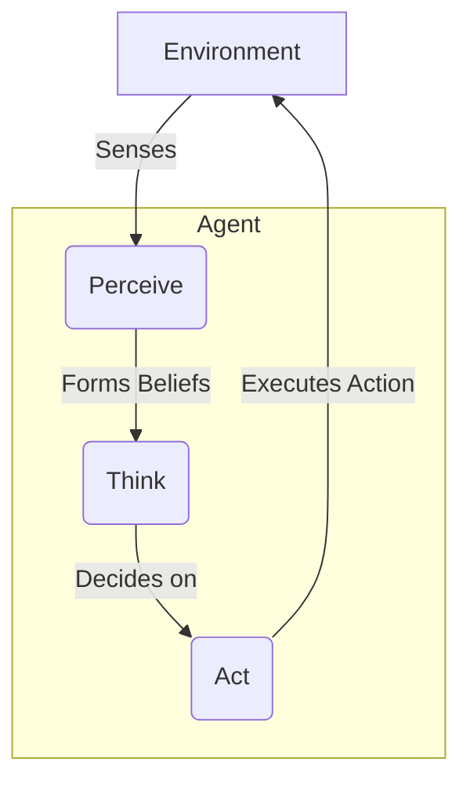

# Chapter 13: From Chatbots to Autonomous Agents

For decades, our interactions with computers have been defined by a simple loop: we make a request, and the machine gives a response. This model powers everything from command-line tools to sophisticated chatbots. But what if an AI could do more than just respond? What if it could perceive its environment, maintain its own goals, make plans, and take action—all without constant human intervention?

This is the leap from a simple tool to an **autonomous agent**. A chatbot is like a calculator: it answers the specific question you ask and then waits for the next one. An agent, by contrast, is like a financial advisor who actively monitors your portfolio, identifies opportunities based on market changes, rebalances your assets according to your long-term goals, and alerts you to critical risks.

In this chapter, we will deconstruct the magic behind AI agents. We will move beyond the request-response paradigm and architect systems that can think, plan, and act in the world.

### Learning Objectives

By the end of this chapter, you will be able to:

-   Clearly distinguish between a stateless chatbot and a goal-oriented agent.
-   Understand the core components that form an agent's "mind": perception, memory, reasoning, and action.
-   Architect a simple agent from scratch, building each component step-by-step.
-   Assemble these components into a functioning, autonomous IoT monitoring agent.
-   Compare different agent architectures and understand their respective trade-offs.

## The Limits of a Simple Chatbot

To appreciate what makes an agent special, let's first look at what it's not. Consider a standard chatbot powered by a Large Language Model (LLM).

```python
import openai

# Assumes the OPENAI_API_KEY environment variable is set
client = openai.OpenAI()

def simple_chatbot(user_input: str) -> str:
    """A basic, stateless chatbot function."""
    response = client.chat.completions.create(
        model="gpt-4o-mini",
        messages=[{"role": "user", "content": user_input}]
    )
    return response.choices[0].message.content

# Each call to the function is a world of its own, with no memory of the past.
print(simple_chatbot("What is the current temperature of sensor T-001?"))
# Expected Response: "I'm sorry, but I don't have access to real-time data..."

print(simple_chatbot("Please check it again."))
# Expected Response: "I'm not sure what you mean by 'it'. Could you please clarify?"
```

This chatbot suffers from three fundamental limitations:

1.  **No Memory:** Every interaction is completely isolated. It cannot remember previous questions or its own answers. The second question, "Please check it again," is meaningless because the context of "it" is lost.
2.  **No Tools:** It cannot *do* anything. It can't query a database, read a sensor, or call an API. It's a closed system.
3.  **No Goals:** It is purely reactive. It has no long-term objectives it's trying to achieve. It simply waits for a prompt and responds.

An agent is designed to overcome these very limitations. It has memory, it can use tools, and it operates based on a set of goals.

## The Agent Loop: A Blueprint for Autonomy

At its core, an intelligent agent operates on a continuous cycle. This is often called the **Perceive-Think-Act** loop. It's the fundamental pattern of behavior that allows an agent to interact with its environment in a meaningful and autonomous way.



1.  **Perceive:** The agent gathers information from its environment using a set of "sensors." This could be data from an IoT device, new messages in a chat, a stock price update, or the contents of a file.
2.  **Think:** The agent processes these perceptions. It updates its internal model of the world (its "beliefs"), reasons about the situation based on its goals, and decides on a course of action. This is the agent's "brain," often powered by an LLM.
3.  **Act:** The agent executes the chosen action, affecting the environment. This could involve sending an alert, writing to a database, restarting a server, or sending a message to a user.

This loop runs continuously, allowing the agent to adapt and respond to a changing world. Over the next sections, we will build Python classes that represent each stage of this loop.

## The Anatomy of an Agent

Let's construct our agent piece by piece, starting with its ability to sense the world.

### 1. Perception: The Agent's Senses

An agent's perception system is its window to the world. It's responsible for gathering raw data and structuring it into a format the agent can understand. We'll design a `PerceptionSystem` that can be configured with different "sensors"—functions that know how to read specific types of data from the environment.

First, let's define the class skeleton. It will hold a registry of sensor functions.

```python
from typing import Dict, Any, Callable, List

class PerceptionSystem:
    """Manages how an agent senses its environment."""
    def __init__(self):
        self.sensors: Dict[str, Callable] = {}

    def register_sensor(self, sensor_name: str, sensor_function: Callable):
        """Adds a new sensor to the agent's perception capabilities."""
        print(f"Sensor '{sensor_name}' registered.")
        self.sensors[sensor_name] = sensor_function
```

With `register_sensor`, we can give our agent new ways to perceive the world without modifying the core class. Now, let's define a sensor. A sensor is just a Python function that takes the state of the "environment" (represented as a dictionary) and extracts relevant information.

Here's a sensor for reading device temperatures.

```python
def temperature_sensor(environment: Dict[str, Any]) -> Dict[str, float]:
    """A sensor that extracts temperature readings from devices."""
    temps = {}
    for device_id, data in environment.get("devices", {}).items():
        if "temperature" in data:
            temps[device_id] = data["temperature"]
    return temps
```

Finally, we need the `perceive` method. This method orchestrates all registered sensors, runs them against the current environment data, and aggregates their findings into a single, structured perception.

```python
# Continuing the PerceptionSystem class...

    def perceive(self, environment: Dict[str, Any]) -> Dict[str, Any]:
        """Gathers data from all registered sensors."""
        all_perceptions = {}
        for name, func in self.sensors.items():
            try:
                # Run the sensor function and store its output
                all_perceptions[name] = func(environment)
            except Exception as e:
                all_perceptions[name] = {"error": str(e)}
        return all_perceptions
```

Let's see it in action. We'll create a perception system, register our sensor, and feed it some simulated environment data.

```python
import json

# 1. Create the system
perception_system = PerceptionSystem()

# 2. Register our sensor
perception_system.register_sensor("temperatures", temperature_sensor)

# 3. Define a simulated environment state
test_environment = {
    "devices": {
        "device_001": {"temperature": 75.2, "status": "online"},
        "device_002": {"temperature": 91.5, "status": "online"}, # High temp!
        "device_003": {"status": "offline"}, # No temperature data
    }
}

# 4. Run the perception cycle
current_perceptions = perception_system.perceive(test_environment)

print("\nAgent Perceptions:")
print(json.dumps(current_perceptions, indent=2))
```

**Output:**

```
Sensor 'temperatures' registered.

Agent Perceptions:
{
  "temperatures": {
    "device_001": 75.2,
    "device_002": 91.5
  }
}
```

Our agent can now "see" the temperatures of the devices. This structured data is the input for the next stage: thinking.

### 2. Memory: The Agent's Mind

A perception is fleeting. To make intelligent decisions, an agent must remember past perceptions, actions, and conclusions. A memory system provides this context.

A sophisticated memory system might have multiple layers (short-term, long-term, episodic), but let's start with the most critical one: a **short-term memory** that remembers recent events. We can use Python's `collections.deque` with a `maxlen` to create a memory that automatically discards the oldest items.

```python
from collections import deque
from datetime import datetime
from typing import Deque, Dict, Any, List

class MemorySystem:
    """Manages the agent's memory."""
    def __init__(self, short_term_capacity: int = 100):
        # A deque automatically discards old items when the max length is reached.
        self.short_term: Deque[Dict] = deque(maxlen=short_term_capacity)

    def store(self, memory_item: Dict[str, Any]):
        """Stores an item in the agent's short-term memory."""
        memory_item["timestamp"] = datetime.now()
        self.short_term.append(memory_item)
        print(f"Stored in memory: {memory_item['type']}")

    def recall(self, query: str) -> List[Dict]:
        """Retrieves memories that match a simple text query."""
        # This is a very basic search, more advanced systems use vector search.
        query_lower = query.lower()
        results = [
            mem for mem in self.short_term 
            if query_lower in json.dumps(mem).lower()
        ]
        return results
```

Let's test our memory system. We'll store the perceptions we gathered in the previous step and then try to recall information.

```python
# Create a memory system
memory = MemorySystem()

# Store our perception event
memory.store({
    "type": "perception",
    "data": current_perceptions
})

# Store another event, an action the agent took (hypothetically)
memory.store({
    "type": "action",
    "action_name": "log_status",
    "parameters": {"device_id": "device_001"}
})

# Now, let's recall information about device_002
recalled_memories = memory.recall("device_002")

print("\nRecalled Memories for 'device_002':")
print(json.dumps(recalled_memories, indent=2, default=str))
```

**Output:**

```
Stored in memory: perception
Stored in memory: action

Recalled Memories for 'device_002':
[
  {
    "type": "perception",
    "data": {
      "temperatures": {
        "device_001": 75.2,
        "device_002": 91.5
      }
    },
    "timestamp": "..."
  }
]
```

With memory, our agent now has context. It can connect the dots between past and present, which is essential for the reasoning process.

### 3. Reasoning: The Agent's Brain

The reasoning engine is where the "thinking" happens. It takes the agent's current perceptions and relevant memories, considers its goals, and decides what to do next. This is the perfect job for an LLM.

Our `ReasoningEngine` will have a single, powerful method: `reason`. It will format the available information into a prompt for the LLM and parse its structured JSON response.

```python
class ReasoningEngine:
    """The agent's decision-making component, powered by an LLM."""
    def __init__(self, model: str = "gpt-4o-mini"):
        self.client = openai.OpenAI()
        self.model = model

    def reason(self, goal: str, context: Dict[str, Any]) -> Dict[str, Any]:
        """Analyzes the context and decides on the next actions."""
        prompt = f"""
You are the reasoning core of an autonomous IoT monitoring agent.

Your primary goal is: "{goal}"

Here is the current context based on your recent perceptions and memories:
{json.dumps(context, indent=2, default=str)}

Based on this context and your primary goal, analyze the situation and recommend the next course of action.
Your response MUST be a JSON object with the following structure:
{{
  "analysis": "A brief, one-sentence analysis of the situation.",
  "recommended_actions": [
    {{
      "action_name": "name_of_the_action_to_take",
      "parameters": {{ "key": "value" }}
    }}
  ]
}}
"""
        
        response = self.client.chat.completions.create(
            model=self.model,
            messages=[{"role": "system", "content": prompt}],
            response_format={"type": "json_object"},
            temperature=0.1,
        )
        
        decision = json.loads(response.choices[0].message.content)
        return decision
```

Let's feed our engine the high-temperature perception we've been tracking. We'll give it a clear goal and the context from our memory.

```python
# Create the reasoning engine
reasoner = ReasoningEngine()

# Define the agent's goal and the current context
agent_goal = "Ensure all devices operate within safe temperature limits (< 90 degrees)."
current_context = {
    "recent_perceptions": current_perceptions,
    "active_alerts": 0
}

# Let the agent think
decision = reasoner.reason(goal=agent_goal, context=current_context)

print("\nAgent's Decision:")
print(json.dumps(decision, indent=2))
```

**Example Output:**

```
Agent's Decision:
{
  "analysis": "Device device_002 is operating above the safe temperature limit of 90 degrees.",
  "recommended_actions": [
    {
      "action_name": "send_alert",
      "parameters": {
        "device_id": "device_002",
        "level": "critical",
        "message": "Temperature has exceeded 90 degrees."
      }
    }
  ]
}
```

The agent has analyzed the situation, identified the problem, and decided on a concrete action: `send_alert`. Now it needs a way to execute that action.

### 4. Action: The Agent's Hands

The action system connects the agent's decisions to the real world. It's a library of "tools" that the agent can use. Like the perception system, it's designed to be extensible. We can register new actions without changing the core logic.

```python
class ActionSystem:
    """Executes actions and interacts with the environment."""
    def __init__(self):
        self.actions: Dict[str, Callable] = {}

    def register_action(self, action_name: str, action_function: Callable):
        """Makes a new action available to the agent."""
        print(f"Action '{action_name}' registered.")
        self.actions[action_name] = action_function

    def execute(self, action_name: str, parameters: Dict[str, Any]) -> Dict[str, Any]:
        """Executes a named action with given parameters."""
        if action_name not in self.actions:
            error_msg = f"Error: Action '{action_name}' not found."
            print(error_msg)
            return {"status": "error", "message": error_msg}
        
        try:
            print(f"Executing action: {action_name} with params: {parameters}")
            result = self.actions[action_name](parameters)
            return {"status": "success", "result": result}
        except Exception as e:
            error_msg = f"Error executing '{action_name}': {e}"
            print(error_msg)
            return {"status": "error", "message": error_msg}
```

Now, let's implement the `send_alert` function that our reasoning engine recommended. In a real system, this might send an email or a Slack message. Here, it will just print to the console.

```python
def send_alert_action(parameters: Dict[str, Any]) -> str:
    """A tool that sends an alert."""
    device_id = parameters.get("device_id")
    level = parameters.get("level", "info").upper()
    message = parameters.get("message")
    
    alert_message = f"🚨 [{level}] ALERT for {device_id}: {message}"
    print(alert_message)
    return f"Alert sent for {device_id}"
```

With our system and action defined, let's execute the decision made by the reasoning engine.

```python
# 1. Create the action system
action_system = ActionSystem()

# 2. Register our tool
action_system.register_action("send_alert", send_alert_action)

# 3. Get the recommended action from the agent's decision
recommended_action = decision["recommended_actions"][0]

# 4. Execute the action
execution_result = action_system.execute(
    action_name=recommended_action["action_name"],
    parameters=recommended_action["parameters"]
)

print(f"\nExecution Result: {execution_result}")
```

**Output:**

```
Action 'send_alert' registered.
Executing action: send_alert with params: {'device_id': 'device_002', 'level': 'critical', 'message': 'Temperature has exceeded 90 degrees.'}
🚨 [CRITICAL] ALERT for device_002: Temperature has exceeded 90 degrees.

Execution Result: {'status': 'success', 'result': 'Alert sent for device_002'}
```

We have successfully completed one full Perceive-Think-Act cycle!

## Assembling the Full Agent

Now that we've built and tested each component in isolation, we can assemble them into a single `AutonomousIoTAgent` class. This class will manage the components and run the main autonomous loop.

First, the `__init__` method will create instances of the four systems we designed.

```python
import asyncio

class AutonomousIoTAgent:
    """A fully autonomous agent that integrates all components."""
    def __init__(self, name: str, goal: str):
        self.name = name
        self.goal = goal
        self.is_running = False

        # Integrate the components we built
        self.perception = PerceptionSystem()
        self.memory = MemorySystem()
        self.reasoner = ReasoningEngine()
        self.actions = ActionSystem()

        # Initialize the agent's capabilities
        self._initialize_capabilities()
        
        print(f"Agent '{self.name}' initialized with goal: '{self.goal}'")
        
    def _initialize_capabilities(self):
        """A helper method to register all sensors and actions."""
        self.perception.register_sensor("temperatures", temperature_sensor)
        self.actions.register_action("send_alert", send_alert_action)
```

Next, the `run_cycle` method orchestrates one pass of the Perceive-Think-Act loop. This is the heart of the agent's autonomous behavior.

```python
# Continuing the AutonomousIoTAgent class...

    async def run_cycle(self, environment: Dict[str, Any]):
        """Runs a single Perceive-Think-Act cycle."""
        print(f"\n--- Running cycle at {datetime.now().isoformat()} ---")
        
        # 1. PERCEIVE
        perceptions = self.perception.perceive(environment)
        self.memory.store({"type": "perception", "data": perceptions})

        # 2. THINK
        context = {"recent_perceptions": perceptions}
        decision = self.reasoner.reason(self.goal, context)
        self.memory.store({"type": "decision", "data": decision})

        # 3. ACT
        for action in decision.get("recommended_actions", []):
            result = self.actions.execute(action["action_name"], action["parameters"])
            self.memory.store({
                "type": "action_result",
                "action": action,
                "result": result
            })
```

Finally, the `start` method runs these cycles repeatedly, allowing the agent to operate over time.

```python
# Continuing the AutonomousIoTAgent class...

    async def start(self, environment_simulation, interval_seconds: int = 10):
        """Starts the agent's autonomous loop."""
        self.is_running = True
        while self.is_running:
            current_environment = environment_simulation()
            await self.run_cycle(current_environment)
            await asyncio.sleep(interval_seconds)

    def stop(self):
        """Stops the agent's loop."""
        self.is_running = False
        print(f"Agent '{self.name}' stopping.")
```

Let's run our complete agent. We'll create a simple function to simulate a changing environment where one sensor's temperature gradually increases.

```python
# A simple function to simulate a dynamic environment
device_states = {
    "device_001": {"temperature": 75.2, "status": "online"},
    "device_002": {"temperature": 85.0, "status": "online"},
}
def simulate_environment():
    # Increase the temperature of device_002 over time
    device_states["device_002"]["temperature"] += 2.0
    print(f"\n[Environment Update] Device 002 Temp: {device_states['device_002']['temperature']:.1f}")
    return {"devices": device_states}

async def main():
    agent = AutonomousIoTAgent(
        name="IoT-Sentinel-01", 
        goal="Ensure all devices operate within safe temperature limits (< 90 degrees)."
    )
    
    # In a real application, the agent would run indefinitely.
    # Here, we'll stop it after a few cycles for demonstration.
    try:
        # Run the agent for 3 cycles (30 seconds)
        await asyncio.wait_for(agent.start(simulate_environment, interval_seconds=5), timeout=18)
    except asyncio.TimeoutError:
        agent.stop()

# To run this in a script or Jupyter notebook:
# asyncio.run(main())
```

If you run this code, you will see the agent do nothing for the first few cycles. But once the simulated temperature of `device_002` crosses 90 degrees, the agent's reasoning engine will kick in, and it will autonomously execute the `send_alert` action, fulfilling its goal. This is the power of autonomous agents in action.

## Conclusion

We have journeyed from a simple, stateless chatbot to a fully autonomous agent. By systematically building the core components of perception, memory, reasoning, and action, we have demystified the process. You now understand that an agent is not a monolithic black box, but a system of cooperating parts, each with a clear responsibility.

You have learned to:
-   Structure agent behavior around the **Perceive-Think-Act** loop.
-   Design extensible systems for sensing the environment and acting upon it.
-   Leverage LLMs as the core reasoning engine for decision-making.
-   Assemble these parts into a cohesive, goal-driven autonomous entity.

This foundation is the springboard into the wider world of agentic AI. From here, you can explore more advanced topics like multi-agent collaboration, complex tool use, and long-term planning. The principles you've learned today are the universal building blocks for creating intelligent systems that can actively solve problems in the world.

# References and Further Reading

- AI Agent Index (MIT). https://aiagentindex.mit.edu/
- Understanding AI Agents: How They Work, Types, and Practical Applications (Medium). https://medium.com/@williamwarley/understanding-ai-agents-how-they-work-types-and-practical-applications-bd261845f7c3
- AI Agents for Dummies: A Beginner’s Guide to Autonomous AI (Medium). https://michielh.medium.com/ai-agents-for-dummies-c1b5b5e6c4b4
- AI Agents: Technical Overview, Architecture, and Implementation (Medium). https://sen-abby.medium.com/ai-agents-technical-overview-architecture-and-implementation-8811df690565
- How we built our multi-agent research system (Anthropic, 2025): https://www.anthropic.com/engineering/built-multi-agent-research-system