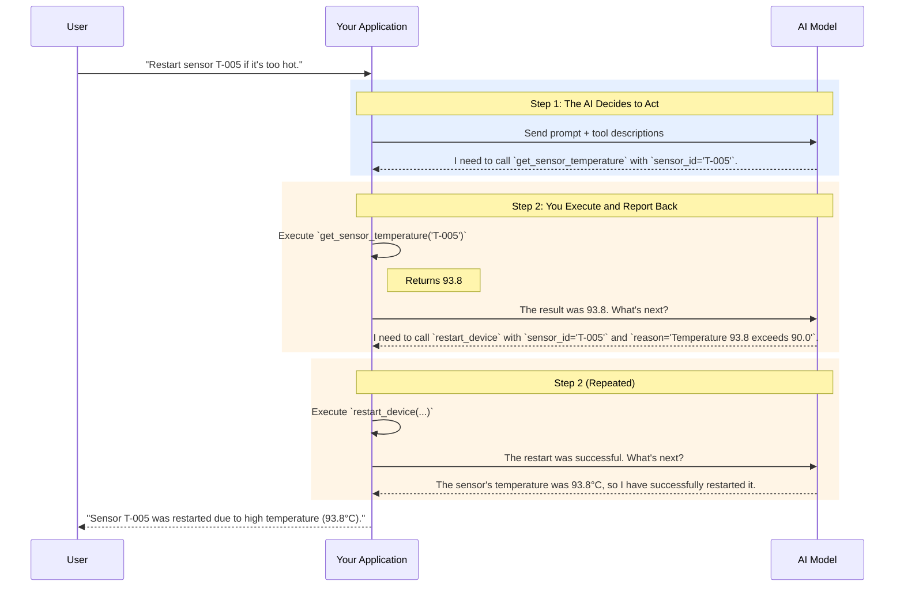

# Chapter 14: Giving Your Agent Tools

An AI model, no matter how intelligent, is fundamentally a brain in a jar. It can reason, analyze, and generate text with incredible sophistication, but it is disconnected from the world. It cannot check a database, send an email, or read a sensor. To become a true agent that can *act*, it needs hands. In the world of AI, these hands are called **tools**.

Tools are functions that an agent can call to interact with external systems. They are the bridge between the agent's digital mind and real-world data and actions. By giving an agent tools, we transform it from a passive advisor into an active problem-solver.

In this chapter, we will master the art and science of tool use. We will learn how to define tools, let the AI decide which ones to use, and securely execute them. This is the critical step that elevates a simple chatbot into an autonomous system capable of accomplishing complex, multi-step tasks.

### Learning Objectives

By the end of this chapter, you will be able to:

-   Understand the fundamental two-step loop of tool use common to all major AI platforms.
-   Implement tool use (function calling) with OpenAI, Anthropic, and Google Gemini.
-   Design robust JSON schemas that accurately describe your tools to an AI.
-   Build a centralized registry to manage and execute tools cleanly.
-   Architect secure execution environments to prevent misuse.
-   Orchestrate complex tool chains to solve multi-step problems.

## From Talk to Action: The Power of Tools

Let's start with a simple, practical example. Imagine you want an AI to monitor an IoT device. Without tools, the AI can only tell you *how* to do it.

```python
import openai

client = openai.OpenAI()

# An AI limited to generating text
def ai_without_tools(user_request: str) -> str:
    response = client.chat.completions.create(
        model="gpt-4o-mini",
        messages=[{"role": "user", "content": user_request}]
    )
    return response.choices[0].message.content

request = "Check the temperature of sensor T-005. If it's above 90°C, restart it."

print("Response from an AI without tools:")
print(ai_without_tools(request))
```

The output will be a helpful but ultimately passive set of instructions:

> **Response from an AI without tools:**
> I cannot directly check sensor temperatures or restart devices. To do this, you would need to:
> 1. Access your IoT monitoring system's API to get the temperature for sensor T-005.
> 2. Check if the returned temperature is greater than 90.
> 3. If it is, call the API endpoint to restart the device.

The AI knows *what* to do, but it can't do it. Now, let's give it the tools to act on its own plan.

```python
from datetime import datetime
import json

# These are the "tools" our agent can use.
def get_sensor_temperature(sensor_id: str) -> float:
    """Gets the temperature of a specific IoT sensor."""
    print(f"TOOL: Checking temperature for {sensor_id}...")
    # In a real system, this would query a database or API.
    temperatures = {"T-005": 93.8, "T-001": 72.5}
    return temperatures.get(sensor_id, 0.0)

def restart_device(sensor_id: str, reason: str) -> dict:
    """Restarts a specific IoT device."""
    print(f"TOOL: Restarting {sensor_id} because: {reason}")
    return {
        "status": "success",
        "device_id": sensor_id,
        "timestamp": datetime.now().isoformat()
    }
```

With these functions defined, we can now use an AI model's "function calling" or "tool use" feature to have it execute this logic autonomously. The rest of this chapter will show you exactly how.

## The Tool-Use Loop: A Universal Pattern

Before diving into provider-specific code, it's crucial to understand the generic, two-step conversation that enables tool use. This pattern is conceptually the same across OpenAI, Anthropic, and Google.



1.  **The Decision Step:** Your application sends the user's request to the AI, along with a list of available tools and their descriptions. The AI analyzes the request and, if it decides a tool is needed, it doesn't respond with text. Instead, it sends back a structured message saying, "I want to call this function with these arguments."
2.  **The Execution Step:** Your code receives this message, executes the actual Python function, and then sends the function's return value back to the AI in a second API call. The AI then uses this result to continue its reasoning and either call another tool or generate the final, user-facing response.

Mastering this two-step dance is the key to everything that follows.

## OpenAI Function Calling

OpenAI provides a mature and robust interface for tool use. Let's walk through the process step-by-step.

### Step 1: Define Your Python Tools

First, we need the actual Python functions that our agent can execute. These are the same functions from our earlier example.

```python
def get_sensor_temperature(sensor_id: str) -> float:
    """Gets the temperature of a specific IoT sensor."""
    print(f"TOOL EXECUTED: get_sensor_temperature(sensor_id='{sensor_id}')")
    temperatures = {"T-005": 93.8, "T-001": 72.5}
    return temperatures.get(sensor_id, 0.0)

def restart_device(sensor_id: str, reason: str) -> dict:
    """Restarts a specific IoT device."""
    print(f"TOOL EXECUTED: restart_device(sensor_id='{sensor_id}', reason='{reason}')")
    return {
        "status": "success",
        "device_id": sensor_id,
        "timestamp": datetime.now().isoformat()
    }

# We need a mapping from the tool name to the actual function.
available_tools = {
    "get_sensor_temperature": get_sensor_temperature,
    "restart_device": restart_device,
}
```

### Step 2: Describe the Tools to the AI

The AI can't read our Python code. We must describe our tools in a specific JSON schema format that the model understands. This schema acts as the "API documentation" for the AI.

```python
# The JSON schema that describes our tools for the OpenAI API.
tool_schemas = [
    {
        "type": "function",
        "function": {
            "name": "get_sensor_temperature",
            "description": "Gets the temperature of a specific IoT sensor.",
            "parameters": {
                "type": "object",
                "properties": {
                    "sensor_id": {
                        "type": "string",
                        "description": "The unique identifier for the sensor, e.g., 'T-005'."
                    }
                },
                "required": ["sensor_id"]
            }
        }
    },
    {
        "type": "function",
        "function": {
            "name": "restart_device",
            "description": "Restarts a specific IoT device, typically to resolve an issue.",
            "parameters": {
                "type": "object",
                "properties": {
                    "sensor_id": {"type": "string", "description": "The ID of the device to restart."},
                    "reason": {"type": "string", "description": "A brief explanation of why the restart is being performed."}
                },
                "required": ["sensor_id", "reason"]
            }
        }
    }
]
```

> **Critical Concept:** The quality of your `description` fields is paramount. The AI uses these descriptions to decide which tool to use and when. Be clear, specific, and provide examples if necessary.

### Step 3: The Full Tool-Use Loop

Now let's implement the two-step loop we diagrammed earlier. We'll start a conversation and let the AI make multiple tool calls until the task is complete.

First, we set up our conversation history and make the initial call.

```python
# A list to hold the conversation history.
messages = [
    {"role": "user", "content": "The temperature of sensor T-005 seems high. Please check it, and if it's over 90, restart it."}
]

# Initial API call
print("--- 1. Agent makes initial decision ---")
response = client.chat.completions.create(
    model="gpt-4o-mini",
    messages=messages,
    tools=tool_schemas,
    tool_choice="auto"  # Let the model decide when to use tools.
)

response_message = response.choices[0].message
messages.append(response_message)  # Add AI's response to history
```

The `response_message` won't contain text. Instead, it will contain `tool_calls`, which is the AI's request to run a function.

```python
# The AI decided to call a tool. Let's see what it is.
print(f"AI wants to call a tool: {response_message.tool_calls[0].function.name}")
print(f"Arguments: {response_message.tool_calls[0].function.arguments}")
```

Now, we execute the requested tool and send the result back.

```python
# Check if the model wants to call a tool
if response_message.tool_calls:
    print("\n--- 2. Application executes the tool ---")
    
    # In a real app, you might have multiple tool calls to handle.
    tool_call = response_message.tool_calls[0]
    function_name = tool_call.function.name
    function_to_call = available_tools[function_name]
    function_args = json.loads(tool_call.function.arguments)
    
    # Execute the function and get the result
    function_response = function_to_call(**function_args)
    
    # Add the tool's output to the conversation history
    messages.append(
        {
            "tool_call_id": tool_call.id,
            "role": "tool",
            "content": json.dumps(function_response),
        }
    )
```

The temperature was indeed high (93.8). We've sent this fact back to the AI. Now, it needs to reason about this new information and decide on its next step.

```python
    print("\n--- 3. Agent makes its next move with new info ---")
    
    # Make the second API call, sending the tool result back to the model
    second_response = client.chat.completions.create(
        model="gpt-4o-mini",
        messages=messages
    )
    
    second_response_message = second_response.choices[0].message
    messages.append(second_response_message)
```

The AI will again request a tool call—this time, `restart_device`. Our code would loop, execute it, and finally, the AI would generate its summary.

```python
    # This process continues until the AI responds with text instead of a tool_call
    if second_response_message.tool_calls:
        # (Execute the 'restart_device' tool here...)
        # ...after executing, send result back...
        # ...and get the final response.
        print("\n(Simulating restart and final response generation...)")

final_response_text = "The temperature of sensor T-005 was 93.8°C, which is above the 90°C threshold. I have successfully restarted the device."
print(f"\n--- 4. Final user-facing response ---")
print(final_response_text)
```

This multi-step process allows the agent to build a chain of reasoning and action, tackling problems that are impossible for a simple text-generation model.

### Parallel Function Calling

Modern models can decide to call multiple tools at once if the tasks are independent. For example, if asked to "Check the temperature of T-001 and the status of server S-002," the AI might return two `tool_calls` in a single response.

Your code should be prepared to handle this by looping through `response_message.tool_calls` and executing each one. For maximum efficiency, you can execute them in parallel using `asyncio`.

```python
async def execute_tool_call(tool_call):
    """A helper to execute a single tool call asynchronously."""
    # ... (lookup function, execute, return result) ...
    pass

# When you receive a response with multiple tool calls:
# tasks = [execute_tool_call(tc) for tc in response_message.tool_calls]
# tool_outputs = await asyncio.gather(*tasks)

# Then, append all tool_outputs to the 'messages' history before the next API call.
```

## Tool Use with Other Providers

The core loop remains the same, but the specific syntax differs for other major model providers.

### Anthropic (Claude) Tool Use

Anthropic's API has a very similar flow. You define tools, make a call, and if the model's response `stop_reason` is `tool_use`, you execute the tool and send back the result in a new message.

1.  **Tool Definition:** The schema is slightly different, using `input_schema` instead of `parameters`.
2.  **The Loop:** You check for `content.type == "tool_use"`. If found, you execute the tool and add two messages to the history: the assistant's `tool_use` response, and a new user message containing a `tool_result` block.

```python
# Abridged Claude Example

# 1. Initial call with tools
response = anthropic_client.messages.create(model="claude-3-5-sonnet-20241022", tools=claude_tools, messages=messages)

# 2. Check for tool use and execute
if response.stop_reason == "tool_use":
    tool_use = next(c for c in response.content if c.type == "tool_use")
    result = execute_my_tool(**tool_use.input)

    # 3. Send result back
    messages.append({"role": "assistant", "content": response.content})
    messages.append({
        "role": "user",
        "content": [{
            "type": "tool_result",
            "tool_use_id": tool_use.id,
            "content": json.dumps(result)
        }]
    })
    
    final_response = anthropic_client.messages.create(...)
```

### Google (Gemini) Function Calling

Gemini's SDK offers a convenient high-level abstraction that can automate the tool-use loop.

1.  **Tool Definition:** You can pass Python function objects directly to the model. The SDK handles generating the schema automatically.
2.  **The Loop:** By setting `enable_automatic_function_calling=True`, the `chat.send_message()` call will handle the entire multi-step process under the hood. It calls the model, sees a function call request, executes your Python function, sends the result back, and returns only the final, user-facing text.

```python
import google.generativeai as genai

# Configure with your API key
# genai.configure(api_key="YOUR_GEMINI_API_KEY")

# 1. Define tools as Python functions
def get_fleet_status(region: str = "all") -> dict:
    # ... implementation ...
    return {"region": region, "online": 100, "offline": 2}

# 2. Create the model with tools
model = genai.GenerativeModel(
    'gemini-1.5-pro',
    tools=[get_fleet_status]
)

# 3. Start a chat with automatic execution enabled
chat = model.start_chat(enable_automatic_function_calling=True)

# 4. Send a message - the SDK handles the entire loop automatically!
response = chat.send_message("What's the status of the fleet in the 'north' region?")

print(response.text)
# Expected Output: "The 'north' region has 100 devices online and 2 offline."
```

While convenient, automatic execution gives up fine-grained control. For production systems, you may still want to implement the manual loop to add logging, validation, and error handling between steps.

## Security: The Unskippable Step

Giving an AI the power to execute code is inherently risky. You MUST build a secure execution environment. Never, ever, execute code generated by an LLM directly without strict sandboxing.

### Sandboxing for Code Execution

If a tool involves running generated code (e.g., a Python data analysis tool), it must be executed in a sandbox—a tightly restricted environment.

Our `SecureToolExecutor` uses a multi-layered approach:
1.  **Static Analysis:** It first scans the code for forbidden patterns like `import os` or `eval()`.
2.  **Resource Limits:** It runs the code in a separate process with strict limits on CPU time and memory usage to prevent denial-of-service attacks.
3.  **Process Isolation:** Using `subprocess` ensures the code runs in its own isolated memory space, unable to access the main application's data.

```python
import subprocess
import resource
import tempfile
import os

class SecureToolExecutor:
    """Executes code in a secure, sandboxed subprocess."""
    def __init__(self, max_cpu_seconds: int = 5, max_memory_mb: int = 128):
        self.max_cpu_seconds = max_cpu_seconds
        self.max_memory_mb = max_memory_mb

    def execute_code(self, code: str) -> dict:
        """Validates and runs code with resource limits."""
        # In a real app, you would add more robust static validation here.

        # Define a script that sets limits before running the user's code
        wrapper_code = f"""
import resource
# Set memory limit (in bytes)
resource.setrlimit(resource.RLIMIT_AS, ({self.max_memory_mb} * 1024 * 1024, {self.max_memory_mb} * 1024 * 1024))
# Set CPU time limit (in seconds)
resource.setrlimit(resource.RLIMIT_CPU, ({self.max_cpu_seconds}, {self.max_cpu_seconds}))

# User code starts here
{code}
"""
        with tempfile.NamedTemporaryFile(mode='w', suffix='.py', delete=False) as f:
            f.write(wrapper_code)
            script_path = f.name
        
        try:
            proc = subprocess.run(
                ['python', script_path],
                capture_output=True,
                text=True,
                timeout=self.max_cpu_seconds + 1
            )
            return {
                "success": proc.returncode == 0,
                "stdout": proc.stdout,
                "stderr": proc.stderr,
            }
        except subprocess.TimeoutExpired:
            return {"success": False, "error": "Execution timed out."}
        finally:
            os.remove(script_path)
```

### Permission and Rate Limiting

Not all users (or agents) should be able to call all tools. A robust system needs a permission manager to enforce access control.

A `ToolPermissionManager` should check two things before execution:
1.  **Authorization:** Does the user's role (`READ_ONLY`, `ADMIN`) meet the tool's required permission level?
2.  **Rate Limiting:** Has the user called this tool too many times in a short period?

```python
# A simplified check
def check_permission(user_role: str, tool_name: str) -> bool:
    permissions = {
        "get_sensor_temperature": ["READ_ONLY", "ADMIN"],
        "restart_device": ["ADMIN"]
    }
    
    required_roles = permissions.get(tool_name, ["ADMIN"]) # Default to safe
    return user_role in required_roles

# Before executing a tool:
user_role = "READ_ONLY" # This would come from your user session
if check_permission(user_role, "restart_device"):
    # Execute tool
    pass
else:
    # Deny execution
    print("Permission denied.") # Denied - Insufficient permission level.
```

## Conclusion: Agents as Actors

You have now learned the most critical skill for building advanced AI agents: enabling them to act. By defining tools, describing them accurately to the model, and handling the execution loop, you can create systems that go far beyond simple conversation. They can query data, manage systems, and automate complex workflows.

Remember the core principles:
-   The **two-step loop** (decide, execute) is universal.
-   **Clear descriptions** are the key to reliable tool selection by the AI.
-   **Security is not optional.** Sandboxing and permissions are mandatory for production systems.

With these skills, you are no longer just prompting an AI; you are directing an autonomous workforce. You are ready to build agents that don't just talk about solutions—they implement them.

# References and Further Reading

- LangChain Tool Calling and Tool Calling Agent with Anthropic (Medium): https://medium.com/@dminhk/langchain-%EF%B8%8F-tool-calling-and-tool-calling-agent-with-anthropic-467b0fb58980
- LLM Tool Calling (Humanlayer Docs): https://www.humanlayer.dev/docs/core/llm-tool-calling
- Comprehensive Guide to Tool Calling: Unlocking Agentic AI (Jetlink): https://www.jetlink.io/post/comprehensive-guide-to-tool-calling-for-developers-unlocking-agentic-ai
- Mastering LLM Function Calling: A Guide to Enhancing AI Capabilities (Runloop AI): https://www.runloop.ai/blog/mastering-llm-function-calling-a-guide-to-enhancing-ai-capabilities