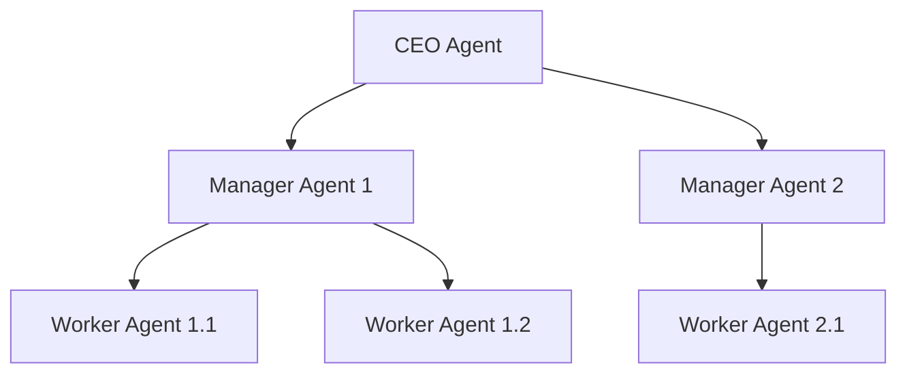

# Chapter 16: An Introduction to Multi-Agent Systems

So far, we have focused on building and refining single, autonomous agents. These agents can be incredibly powerful, but they are like a brilliant solo performer. To tackle truly large-scale, complex problems, we often need more than a soloist; we need an entire orchestra. This is the domain of **multi-agent systems (MAS)**.

A multi-agent system is a collection of autonomous agents that interact with each other and their environment to solve problems that are beyond the capabilities of any single agent. Instead of one monolithic AI trying to do everything, we create a society of specialized agents that collaborate, negotiate, and coordinate their actions.

In this chapter, we will explore the fundamental principles behind multi-agent systems. We'll learn how to make agents communicate, how they can work together in different organizational structures, and how they can make group decisions.

### Learning Objectives

By the end of this chapter, you will:

-   Understand the core advantages of a multi-agent approach over a single-agent architecture.
-   Design and implement basic communication protocols for agent interaction.
-   Explore different patterns of agent collaboration, including centralized and hierarchical models.
-   Implement a consensus mechanism to enable agents to make group decisions.
-   Architect a complete smart city coordination system using a multi-agent approach.

## Why Multiple Agents? The Power of Specialization

Imagine managing a smart city with thousands of IoT devices: traffic lights, emergency systems, air quality monitors, and power grids. A single agent tasked with managing all of this would be a jack-of-all-trades but a master of none. It would be a bottleneck, a single point of failure, and incredibly complex to maintain.

A multi-agent system offers a more robust and scalable solution:

-   **Traffic Agent:** Expert in traffic flow optimization.
-   **Emergency Agent:** Expert in coordinating first responders.
-   **Environment Agent:** Expert in analyzing pollution data.
-   **Utilities Agent:** Expert in managing the power grid.

This division of labor is the key. Each agent is simpler, more focused, and more effective within its domain. The system's true intelligence emerges from their collaboration.

### From a Single Agent to a Team

Let's start by seeing the difference in practice. Here's how a single agent might struggle with a complex task.

```python
# A single agent must be a generalist, which dilutes its expertise.
class SingleAgent:
    def process(self, task: str) -> str:
        prompt = f"""
You are an AI assistant that must handle ALL city management tasks.
Task: {task}
Provide a solution:
"""
        # This prompt is too broad to elicit a deep, expert response.
        # The AI has to guess which "hat" to wear.
        return f"Generic response for: {task}"
```

Now, let's create a system of specialized agents.

```python
class SpecializedAgent:
    """An agent that is an expert in a single, well-defined domain."""
    def __init__(self, name: str, specialty: str, expertise: str):
        self.name = name
        self.specialty = specialty
        self.expertise = expertise
    
    def can_handle(self, task: str) -> bool:
        """A simple check to see if the task falls within the agent's specialty."""
        task_lower = task.lower()
        # In a real system, this would use a more sophisticated classification model.
        return self.specialty in task_lower

    def process(self, task: str) -> str:
        """Processes a task using its deep, specialized knowledge."""
        prompt = f"""
You are {self.name}, a world-class expert in {self.specialty}.
Your specific expertise includes: {self.expertise}.
Task: {task}
Provide a detailed, expert-level plan.
"""
        # This focused prompt will generate a much higher-quality response.
        return f"Expert {self.specialty} plan for: {task}"
```

With specialized agents, the next step is to create a system that can route tasks to the correct expert.

```python
class SimpleMultiAgentSystem:
    """A basic system to coordinate and route tasks to specialized agents."""
    def __init__(self):
        self.agents: list[SpecializedAgent] = []

    def add_agent(self, agent: SpecializedAgent):
        """Adds a new specialist agent to the system."""
        self.agents.append(agent)
        print(f"Agent Registered: {agent.name} (Specialty: {agent.specialty})")

    def route_task(self, task: str) -> str:
        """Finds the best agent for a task and assigns it."""
        print(f"\nNew Task: '{task}'")
        
        # Find the first agent that claims it can handle the task.
        for agent in self.agents:
            if agent.can_handle(task):
                print(f"  -> Routing to expert: {agent.name}")
                return agent.process(task)
        
        print("  -> No specialist found. Routing to default agent.")
        return self.agents[0].process(task) # Fallback to the first agent
```

Let's see this system in action.

```python
# 1. Create the system
system = SimpleMultiAgentSystem()

# 2. Register our specialized agents
system.add_agent(SpecializedAgent(
    name="TrafficFlow",
    specialty="traffic",
    expertise="Traffic flow optimization, congestion management, signal timing"
))
system.add_agent(SpecializedAgent(
    name="EmergencyResponse",
    specialty="emergency",
    expertise="Emergency dispatch, response coordination, crisis management"
))

# 3. Process tasks
system.route_task("Heavy traffic reported on the main highway.")
system.route_task("Building fire reported downtown, requires immediate emergency dispatch.")
```

This simple routing mechanism already demonstrates the core benefit: tasks are handled by agents with the most relevant expertise, leading to better outcomes.

## Agent Communication: The Foundation of Collaboration

For agents to do more than just work on isolated tasks, they must be able to communicate. This requires two things: a standard **message format** and a **delivery system**.

### A Simple Message and Mailbox System

First, let's define what a message looks like. A good message is structured, containing who sent it, who it's for, and what it's about.

```python
from datetime import datetime
from typing import Any, List, Callable
from collections import defaultdict

class Message:
    """A structured message for inter-agent communication."""
    def __init__(self, sender: str, recipient: str, content: Any, msg_type: str = "info"):
        self.sender = sender
        self.recipient = recipient
        self.content = content
        self.msg_type = msg_type  # e.g., 'info', 'request', 'alert'
        self.timestamp = datetime.now()
```

Next, we need a "postal service" to deliver these messages. A `MailboxSystem` acts as a central hub where agents can send and receive mail.

```python
class MailboxSystem:
    """A central message bus for agents."""
    def __init__(self):
        # Each agent gets a "mailbox," which is a list of messages.
        self.mailboxes: dict[str, list] = defaultdict(list)

    def send_message(self, message: Message):
        """Delivers a message to the recipient's mailbox."""
        print(f"📬 Message Sent: {message.sender} -> {message.recipient} ({message.msg_type})")
        self.mailboxes[message.recipient].append(message)

    def get_messages(self, agent_name: str) -> List[Message]:
        """Retrieves all messages for an agent and clears their mailbox."""
        messages = self.mailboxes[agent_name]
        self.mailboxes[agent_name] = []  # Clear after reading
        return messages
```

### Creating Communicating Agents

Now, we can upgrade our `SpecializedAgent` to a `CommunicatingAgent` that uses this mailbox system.

```python
class CommunicatingAgent(SpecializedAgent):
    """An agent that can send and receive messages."""
    def __init__(self, name: str, specialty: str, expertise: str, mailbox: MailboxSystem):
        super().__init__(name, specialty, expertise)
        self.mailbox = mailbox
        self.colleagues: list[str] = [] # A list of other known agents

    def check_inbox(self):
        """Processes incoming messages."""
        messages = self.mailbox.get_messages(self.name)
        for msg in messages:
            print(f"  📨 {self.name} received message from {msg.sender}: '{msg.content}'")
            # In a real system, the agent would process the content here.
            
    def broadcast_finding(self, finding: str):
        """Shares an important finding with all colleagues."""
        print(f"  📢 {self.name} is broadcasting a finding.")
        for colleague_name in self.colleagues:
            message = Message(
                sender=self.name,
                recipient=colleague_name,
                content=finding,
                msg_type="info_share"
            )
            self.mailbox.send_message(message)
```

Let's simulate a scenario where one agent's work creates information useful to another.

```python
# 1. Setup communication infrastructure
mailbox = MailboxSystem()

# 2. Create communicating agents
traffic_agent = CommunicatingAgent("TrafficAI", "traffic", "...", mailbox)
emergency_agent = CommunicatingAgent("EmergencyAI", "emergency", "...", mailbox)

# 3. Let them know about each other
traffic_agent.colleagues = ["EmergencyAI"]
emergency_agent.colleagues = ["TrafficAI"]

# 4. The traffic agent detects an accident
print("\n--- Scenario: Traffic agent detects an accident ---")
traffic_agent.process("Major multi-vehicle accident on highway.")
traffic_agent.broadcast_finding("Road closure on I-5 due to major accident.")

# 5. The emergency agent checks its mail and now has new, critical information.
print("\n--- Emergency agent checks for updates ---")
emergency_agent.check_inbox()
```

This simple exchange—where the traffic agent's output becomes the emergency agent's input—is the fundamental building block of all complex multi-agent collaboration.

## Patterns of Collaboration

Just like human teams, agent societies can be organized in different ways. The structure you choose depends on the complexity of the task and the level of coordination required.

### 1. Centralized Coordination (Manager-Worker)

This is the most straightforward pattern. A "Coordinator" agent acts as a manager. It receives a complex task, breaks it down into smaller subtasks, and delegates them to the appropriate specialist "worker" agents.

```mermaid
graph TD
    subgraph Centralized System
        A[User Request] --> B(Coordinator Agent);
        B -- Subtask 1 --> C[Worker Agent 1 <br> (e.g., Traffic)];
        B -- Subtask 2 --> D[Worker Agent 2 <br> (e.g., Emergency)];
        B -- Subtask 3 --> E[Worker Agent 3 <br> (e.g., Environment)];
        C --> F{Synthesized <br> Solution};
        D --> F;
        E --> F;
        B -- Collects & Synthesizes --> F;
    end
```

Let's implement a `Coordinator` agent.

```python
import json

class Coordinator:
    """A manager agent that plans and delegates tasks to a team."""
    def __init__(self, team: list[SpecializedAgent]):
        self.team = {agent.specialty: agent for agent in team}

    def execute_complex_task(self, complex_task: str):
        print(f"\n--- Coordinator received complex task: '{complex_task}' ---")
        
        # Step 1: Plan the work distribution
        plan = self._create_plan(complex_task)
        print(f"Coordinator's Plan: {plan}")

        # Step 2: Execute the plan
        results = {}
        for subtask in plan.get("subtasks", []):
            specialty = subtask.get("specialist")
            task_desc = subtask.get("subtask")
            if specialty in self.team:
                worker_agent = self.team[specialty]
                print(f"  -> Delegating '{task_desc}' to {worker_agent.name}")
                results[specialty] = worker_agent.process(task_desc)
            else:
                print(f"  -> Warning: No specialist found for '{specialty}'")

        # Step 3: Synthesize the final result
        final_solution = self._synthesize_results(complex_task, results)
        print(f"\n--- Coordinated Solution ---\n{final_solution}")

    def _create_plan(self, task: str) -> dict:
        """Uses an LLM to break a complex task into subtasks for specialists."""
        prompt = f"""
You are a project coordinator. Break down this complex task into a sequence of subtasks for your team of specialists.

Available specialists: {list(self.team.keys())}
Complex Task: {task}

Respond with a JSON object containing a list of subtasks, like this:
{{"subtasks": [{{"specialist": "specialty_name", "subtask": "a specific action"}}]}}
"""
        # In a real implementation, you would call an LLM here.
        # For this example, we'll simulate the LLM's output.
        if "spill" in task:
            return {
                "subtasks": [
                    {"specialist": "traffic", "subtask": "Divert traffic away from the highway spill location."},
                    {"specialist": "emergency", "subtask": "Dispatch hazmat and fire teams to the chemical spill."},
                    {"specialist": "environment", "subtask": "Monitor air quality downwind from the spill."}
                ]
            }
        return {"subtasks": []}

    def _synthesize_results(self, original_task: str, results: dict) -> str:
        """Uses an LLM to combine specialist results into a single answer."""
        # This would also be an LLM call in a real system.
        synthesis = f"Integrated Plan for '{original_task}':\n"
        for specialty, result in results.items():
            synthesis += f"- {specialty.title()} says: {result}\n"
        return synthesis
```

This pattern is effective and easy to debug, but the Coordinator can become a bottleneck.

### 2. Hierarchical Organization (Corporate Structure)

This pattern extends the centralized model into multiple levels, like a corporation with executives, managers, and workers.



A high-level task like "Improve city safety" is given to the CEO agent. The CEO delegates to the "Public Safety Manager," who in turn breaks it down for the "Police Dispatch Worker" and "Fire Department Worker." This structure allows for tackling problems at different levels of abstraction.

### 3. Peer-to-Peer Collaboration

Here, there is no central authority. Agents are equals that discover each other, share information, and negotiate to solve problems. This is more flexible and resilient but can be more chaotic. Consensus mechanisms, which we'll cover next, are vital for this pattern.

## Consensus Mechanisms: How Agents Agree

When there's no single boss, how does the group make a decision? They need a consensus mechanism. This can range from a simple vote to a complex, weighted scoring system.

Let's build a system where agents can vote on a proposed course of action.

```python
class Proposal:
    """A proposal that agents can vote on."""
    def __init__(self, id: str, description: str, proposer: str):
        self.id = id
        self.description = description
        self.proposer = proposer
        self.votes: dict[str, str] = {} # agent_name -> "approve" or "reject"
        self.status = "open"

class VotingAgent(SpecializedAgent):
    """An agent that can evaluate and vote on proposals."""
    def cast_vote(self, proposal: Proposal) -> str:
        """Analyzes a proposal from its specialty's perspective and votes."""
        prompt = f"""
You are {self.name}, an expert in {self.specialty}.
Evaluate this proposal and decide whether to APPROVE or REJECT it based on your expertise.
Proposal: {proposal.description}
Your vote (APPROVE/REJECT):
"""
        # Simulate LLM call to get the vote
        if self.specialty == "traffic" and "traffic" in proposal.description.lower():
            return "APPROVE"
        if self.specialty == "emergency" and "emergency" in proposal.description.lower():
            return "APPROVE"
        # A finance agent might reject a costly proposal.
        if self.specialty == "finance":
            return "REJECT"
        return "APPROVE"

class ConsensusSystem:
    """A system for facilitating group decisions among agents."""
    def __init__(self, agents: list[VotingAgent]):
        self.agents = agents
        self.proposals: dict[str, Proposal] = {}

    def new_proposal(self, description: str, proposer: str) -> Proposal:
        prop_id = f"prop_{len(self.proposals) + 1}"
        proposal = Proposal(prop_id, description, proposer)
        self.proposals[prop_id] = proposal
        print(f"\nNew Proposal '{prop_id}': {description}")
        return proposal

    def conduct_vote(self, proposal: Proposal):
        """Collects votes from all agents and determines the outcome."""
        print(f"--- Conducting vote for '{proposal.id}' ---")
        for agent in self.agents:
            vote = agent.cast_vote(proposal)
            proposal.votes[agent.name] = vote
            print(f"  Vote from {agent.name}: {vote}")

        # Tally the votes
        approvals = list(proposal.votes.values()).count("APPROVE")
        rejections = list(proposal.votes.values()).count("REJECT")
        
        if approvals > rejections:
            proposal.status = "PASSED"
        else:
            proposal.status = "REJECTED"
        
        print(f"--- Vote Result: {proposal.status} (Approve: {approvals}, Reject: {rejections}) ---")
```

Let's test this voting system.

```python
# 1. Create a team of voting agents
voter1 = VotingAgent("TrafficAI", "traffic", "...")
voter2 = VotingAgent("EmergencyAI", "emergency", "...")
voter3 = VotingAgent("FinanceAI", "finance", "...") # An agent with different priorities

# 2. Setup the consensus system
consensus_sys = ConsensusSystem([voter1, voter2, voter3])

# 3. An agent makes a proposal
prop = consensus_sys.new_proposal(
    "Implement a new city-wide emergency vehicle preemption system for all traffic lights.",
    proposer="EmergencyAI"
)

# 4. Conduct the vote
consensus_sys.conduct_vote(prop)
```

In this scenario, the Finance agent would likely vote to reject the costly proposal, potentially leading to a tie or rejection, forcing the agents to negotiate a more cost-effective solution.

## Conclusion

We've only scratched the surface of multi-agent systems, but the core concepts are clear. By moving from a single-agent mindset to a multi-agent one, we unlock the ability to solve problems of a much greater scale and complexity.

The key takeaways are:
-   **Specialization:** Break down complex domains and assign them to expert agents.
-   **Communication:** Establish a clear, structured way for agents to exchange information.
-   **Collaboration Patterns:** Choose the right organizational structure (e.g., centralized, hierarchical) for your problem.
-   **Consensus:** When agents must agree, implement a formal mechanism for them to make group decisions.

These principles are the foundation for building everything from a small team of collaborating writing assistants to a vast network of agents managing global logistics. You now have the blueprint to design not just a single intelligent entity, but an entire society of them.

# References and Further Reading

- Multi-Agent AI Systems: Foundational Concepts and Architectures (Medium): https://medium.com/@sahin.samia/multi-agent-ai-systems-foundational-concepts-and-architectures-ece9f8859302
- Multiagent Systems: A survey from a machine learning perspective (Peter Stone, Manuela Veloso): https://www.cs.utexas.edu/~pstone/Papers/bib2html/b2hd-MASsurvey.html
- Multiagent Systems, MIT Press, 2013 (Book): http://the-mas-book.info/
- How to Build Multi Agent AI System (Aalpha): https://www.aalpha.net/blog/how-to-build-multi-agent-ai-system/