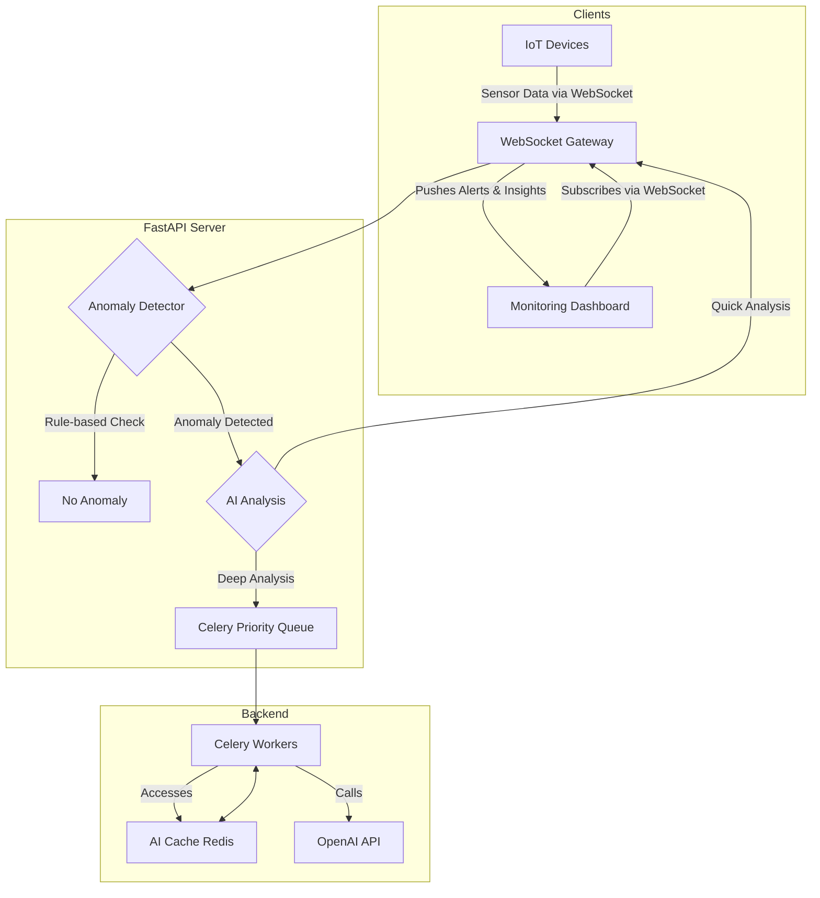

# Chapter 18: Architecting Real-Time AI Applications

In many modern applications, "fast" is not fast enough. We need "now." Imagine an AI monitoring a factory floor; a 30-second delay in analyzing a critical temperature spike could be the difference between a routine adjustment and a catastrophic failure. Consider a financial trading bot; a half-second lag could represent millions of dollars in lost opportunity. This is the domain of real-time AI.

Real-time AI systems are designed to process data, reason, and act with minimal latency. They don't just respond to user requests; they react to a constantly changing world. This chapter will guide you through the architectural patterns and technologies required to build these highly responsive, event-driven AI applications. We will transform our thinking from the simple request-response model to a continuous, asynchronous flow.

### Learning Objectives

By the end of this chapter, you will be able to:

-   Understand the fundamental challenges of building low-latency AI systems.
-   Implement WebSocket connections for persistent, bidirectional communication.
-   Offload long-running AI tasks to background workers using Celery and Redis.
-   Design and implement multi-level caching strategies to dramatically reduce AI response times.
-   Build robust rate limiting and priority queuing systems to manage load and prevent system overload.
-   Architect a complete, real-time IoT anomaly detection system from scratch.

## The Challenge of Real-Time

The traditional, synchronous approach to software development is fundamentally at odds with the demands of real-time systems. Let's examine a naive monitoring function to understand why.

```python
# A synchronous, blocking approach. This is NOT suitable for real-time.
def traditional_monitoring(sensor_readings):
    print(f"Starting analysis of {len(sensor_readings)} readings...")
    start_time = time.time()
    
    for reading in sensor_readings:
        # Each API call blocks the entire process for 1-3 seconds.
        response = openai.chat.completions.create(
            model="gpt-4o-mini",
            messages=[{"role": "user", "content": f"Analyze this reading: {reading}"}]
        )
        print(f"Analyzed reading {reading['id']}.")

    print(f"Finished in {time.time() - start_time:.2f} seconds.")
```

This simple loop has several fatal flaws for a real-time application:

1.  **Blocking Operations:** The `openai.chat.completions.create` call is a network request that blocks all other work until it completes. If you have 10 readings, the system is frozen for the entire duration.
2.  **Sequential Processing:** Readings are analyzed one by one. An urgent, critical alert could be stuck waiting behind nine routine checks.
3.  **No Resilience:** If the fifth API call fails, the entire loop might crash, leaving the remaining readings unanalyzed.
4.  **Inefficiency:** The same patterns might be analyzed repeatedly, wasting time and money on redundant API calls.

To build a true real-time system, we must solve each of these problems.

## WebSockets: The Heartbeat of Real-Time Communication

The foundation of any real-time web application is a persistent, two-way communication channel between the client and the server. While HTTP is a transactional request-response protocol, **WebSockets** provide a continuous, open "phone line."

This means the server can push data to the client *instantly*, without waiting for the client to ask for it. This is essential for live dashboards, chat applications, and monitoring systems.

Let's build a simple WebSocket server with FastAPI that can manage connections from multiple clients.

### A Central Connection Manager

First, we need a class to keep track of all active WebSocket connections.

```python
from fastapi import FastAPI, WebSocket, WebSocketDisconnect
import asyncio

class ConnectionManager:
    """A singleton class to manage active WebSocket connections."""
    def __init__(self):
        self.active_connections: dict[str, WebSocket] = {}

    async def connect(self, websocket: WebSocket, client_id: str):
        """Accepts and stores a new client connection."""
        await websocket.accept()
        self.active_connections[client_id] = websocket
        print(f"Client connected: {client_id}. Total: {len(self.active_connections)}")

    def disconnect(self, client_id: str):
        """Removes a client connection."""
        if client_id in self.active_connections:
            del self.active_connections[client_id]
            print(f"Client disconnected: {client_id}. Total: {len(self.active_connections)}")

    async def broadcast(self, message: str):
        """Sends a message to all connected clients."""
        for connection in self.active_connections.values():
            await connection.send_text(message)

# Create a single, global instance of the manager
manager = ConnectionManager()
```

### The WebSocket Endpoint

Now, we create a FastAPI endpoint that uses this manager. The `@app.websocket` decorator defines a route that handles WebSocket connections.

```python
app = FastAPI()

@app.websocket("/ws/{client_id}")
async def websocket_endpoint(websocket: WebSocket, client_id: str):
    await manager.connect(websocket, client_id)
    try:
        while True:
            # The server waits here for a message from the client.
            data = await websocket.receive_text()
            
            # For this example, we'll just echo the message back to all clients.
            await manager.broadcast(f"Client #{client_id} says: {data}")
    except WebSocketDisconnect:
        manager.disconnect(client_id)
```

This simple structure is the core of real-time interactivity. A client sends a message, and the server can instantly react and push updates to any or all connected clients.

## Offloading Work: Background Task Processing with Celery

Some AI tasks, like analyzing a full day's worth of sensor data, are too slow to run inside a real-time request loop. Executing a 30-second task would freeze your WebSocket connection. The solution is to offload these long-running jobs to a **background task processor**.

**Celery** is the industry standard for this in the Python ecosystem. It allows you to define tasks that can be executed asynchronously by a separate pool of "worker" processes.

### Setting Up a Celery Task

First, we define a task in a separate file, `celery_app.py`. This task will perform a deep analysis of historical device data.

```python
# In celery_app.py
from celery import Celery
import time

# Configure Celery to use Redis as a message broker and result backend.
app = Celery(
    'ai_tasks',
    broker='redis://localhost:6379/0',
    backend='redis://localhost:6379/1'
)

@app.task
def analyze_historical_data(device_id: str):
    """A long-running task to analyze historical data."""
    print(f"Starting deep analysis for {device_id}...")
    # Simulate a long AI analysis process
    time.sleep(15) 
    analysis_report = f"Comprehensive analysis for {device_id} complete. No major issues found."
    print(f"Finished deep analysis for {device_id}.")
    return {"device_id": device_id, "report": analysis_report}
```

To run this, you need two separate processes:
1.  **Celery Worker:** `celery -A celery_app worker --loglevel=info` (This process listens for tasks).
2.  **FastAPI Server:** `uvicorn main:app --reload` (This process submits tasks).

### Triggering Background Tasks from FastAPI

Now, our FastAPI endpoint can trigger this background task without blocking. It immediately returns a `task_id` to the client, who can use it to check the status of the job later.

```python
# In your main FastAPI app file
from celery_app import analyze_historical_data

@app.post("/analysis/start/{device_id}")
async def start_analysis(device_id: str):
    """Triggers a long-running background analysis task."""
    print(f"Submitting deep analysis task for {device_id} to Celery.")
    # .delay() sends the task to the Celery queue.
    task = analyze_historical_data.delay(device_id)
    return {"message": "Analysis started.", "task_id": task.id}

@app.get("/analysis/status/{task_id}")
async def get_analysis_status(task_id: str):
    """Checks the status and result of a background task."""
    task_result = analyze_historical_data.AsyncResult(task_id)
    
    if task_result.ready():
        return {"status": "COMPLETE", "result": task_result.get()}
    else:
        return {"status": "IN_PROGRESS"}
```

This architecture is fundamental to building responsive systems. The web server stays light and fast, handling only quick interactions, while heavy computational work is delegated to a robust, scalable backend system.

## Smart Caching for AI Responses

AI API calls are the biggest performance bottleneck and cost center in most AI applications. A smart caching strategy is not just an optimization; it's a necessity.

We'll build a multi-level cache:
-   **L1 Cache (In-Memory):** An in-memory dictionary for ultra-fast access to the most recently used items.
-   **L2 Cache (Redis):** A distributed cache that persists across application restarts and can be shared by multiple server instances.

```python
import hashlib
import json
from typing import Optional

class AICache:
    """A multi-level cache for AI responses."""
    def __init__(self, redis_client):
        self.redis = redis_client
        self.memory_cache = {} # L1 Cache

    def _generate_key(self, prompt: str, model: str) -> str:
        """Creates a consistent hash key for a request."""
        # Include all parameters that affect the output
        cache_data = {"prompt": prompt, "model": model}
        return hashlib.sha256(json.dumps(cache_data).encode()).hexdigest()

    def get(self, prompt: str, model: str) -> Optional[str]:
        key = self._generate_key(prompt, model)
        
        # 1. Check fast L1 memory cache
        if key in self.memory_cache:
            return self.memory_cache[key]
            
        # 2. Check slower L2 Redis cache
        cached_result = self.redis.get(f"ai_cache:{key}")
        if cached_result:
            # Promote to L1 cache for next time
            self.memory_cache[key] = cached_result
            return cached_result
            
        return None

    def set(self, prompt: str, model: str, response: str, ttl_seconds: int = 3600):
        key = self._generate_key(prompt, model)
        
        # Set in both L1 and L2 caches
        self.memory_cache[key] = response
        self.redis.setex(f"ai_cache:{key}", ttl_seconds, response)
```

By wrapping our AI calls in this cache, we can avoid re-computing answers for frequently asked questions, dramatically improving speed and reducing costs. For example, a request to "analyze normal operating parameters" should be cached for a long time, while an analysis of a "real-time critical alert" should have a very short cache duration.

## Managing Load: Rate Limiting and Priority Queues

A popular real-time system can be easily overwhelmed with requests. We need mechanisms to control the flow of traffic.

1.  **Rate Limiting:** Prevents a single user from overwhelming the system. We can implement a "token bucket" algorithm using Redis to track how many requests a user has made in a given time window.

2.  **Priority Queuing:** Not all tasks are equally important. When the system is under heavy load, we should process a "critical safety alert" before a "routine data summary." A priority queue, easily implemented with Redis Sorted Sets, ensures that high-priority tasks are processed first, even if they were submitted later.

Let's see how a priority queue can be implemented.

```python
class PriorityQueue:
    def __init__(self, redis_client):
        self.redis = redis_client
        self.queue_name = "ai_task_queue"

    def enqueue(self, task: dict, priority: int):
        """Adds a task to the queue. Higher priority numbers are processed first."""
        # The score is a combination of priority and time to ensure FIFO within a priority level.
        score = priority * 1e12 - time.time() 
        self.redis.zadd(self.queue_name, {json.dumps(task): score})

    def dequeue(self) -> Optional[dict]:
        """Removes and returns the highest-priority task."""
        # zpopmax is atomic and returns the item with the highest score.
        task_data = self.redis.zpopmax(self.queue_name)
        if task_data:
            # zpopmax returns a list of (member, score) tuples
            return json.loads(task_data[0][0])
        return None
```

In our application, instead of calling a Celery task directly, we would enqueue it. Our Celery workers would then pull tasks from this priority queue, ensuring that the most important work always gets done first.

## Complete System: Real-Time IoT Anomaly Detection

Let's bring all these concepts together to build our target application: a system that ingests a real-time stream of IoT sensor data and uses AI to detect anomalies.



The workflow is as follows:

1.  IoT devices stream sensor readings to the FastAPI server via a WebSocket connection.
2.  An `AnomalyDetector` class performs an initial, fast, rule-based check (e.g., `if temperature > 90`).
3.  If a potential anomaly is found, it's placed in a priority queue for AI analysis.
4.  A Celery worker picks up the task from the queue.
5.  The worker first checks the `AICache` to see if this exact pattern has been analyzed recently.
6.  If not, it calls the OpenAI API to get a detailed analysis and diagnosis.
7.  The result is stored in the cache.
8.  The final insight is broadcast via the `ConnectionManager` to all subscribed dashboards, appearing on screen in near real-time.

This architecture is robust, scalable, and responsive. It uses cheap, fast computation for initial filtering and reserves expensive, slow AI analysis for the most important events, all while providing a real-time experience to the end-user.

# References and Further Reading

- Bringing Real-Time AI To The Core Of Your Business (LinkedIn): https://www.linkedin.com/pulse/bringing-real-time-ai-core-your-business-bernard-marr
- Real-Time Decision Making with AI-Powered Data Analytics (Medium): https://medium.com/@jesse.henson/real-time-decision-making-with-ai-powered-data-analytics-efca4398f0c4
- Real-Time Policy Enforcement with AI: How It Works (Magai): https://magai.co/real-time-policy-enforcement-with-ai/
- Agents as Escalators: Real-time AI Video Monitoring with Amazon Bedrock Agents and Video Streams (AWS): https://aws.amazon.com/blogs/machine-learning/agents-as-escalators-real-time-ai-video-monitoring-with-amazon-bedrock-agents-and-video-streams/
- Real-Time Machine Learning: The Complete Guide (Xenonstack): https://www.xenonstack.com/blog/real-time-machine-learning
- Real-Time Analytics with AI: Why Speed Matters in the Age of Data (DEV.to): https://dev.to/sanjana_shah_bia/real-time-analytics-with-ai-why-speed-matters-in-the-age-of-data-3006