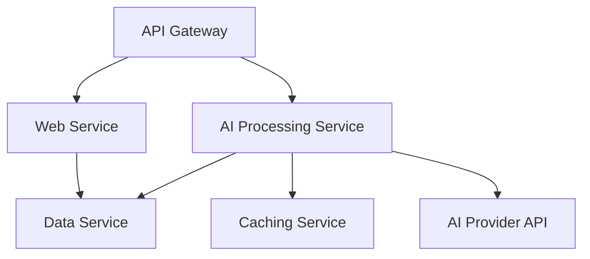

# Chapter 19: AI Application Architecture Patterns

Building a successful AI application involves more than just writing clever prompts. As your application grows from a simple script to a production system, its underlying architecture becomes the single most important factor determining its scalability, reliability, and maintainability. AI-powered systems present unique architectural challenges—variable latency, high computational costs, and complex state management—that traditional software architectures are often ill-equipped to handle.

This chapter is your blueprint for designing robust and scalable AI application architectures. We will explore key patterns, from the trade-offs between monoliths and microservices to the power of event-driven systems. You will learn how to choose the right database for your AI data, manage complex configurations, and build a complete IoT analytics platform from the ground up that embodies these modern architectural principles.

### Learning Objectives

By the end of this chapter, you will be able to:

-   Understand why a thoughtful architecture is critical for production AI applications.
-   Design and contrast monolithic and microservices-based AI architectures.
-   Build scalable, event-driven AI systems using a message bus like Kafka.
-   Choose the right database patterns (e.g., polyglot persistence) for diverse AI data types.
-   Implement sophisticated, centralized configuration management for prompts, models, and keys.
-   Architect a complete, production-ready IoT analytics platform that integrates these patterns.

## Why Architecture Matters for AI Applications

A simple AI script might feel fast and easy, but it hides the complexities that emerge at scale. A production architecture must address:

-   **Variable Latency:** An AI API call can take milliseconds or several seconds. Your system must not block or hang while waiting.
-   **High Resource Usage:** AI models, especially when self-hosted, consume significant CPU, GPU, and memory. This workload needs to be isolated from other parts of your application.
-   **Complex State:** Conversations, user context, and feedback data must be managed, persisted, and made available to the AI.
-   **Cost Control:** Every API call has a cost. The architecture must include mechanisms for caching, rate limiting, and optimizing calls.
-   **Model Versioning:** AI models are constantly evolving. Your architecture must allow you to test and deploy new models and prompts without rewriting the entire application.
-   **Resilience:** Third-party APIs can fail. Your system needs to be resilient, with retries, failovers, and graceful degradation.

## The First Big Decision: Monolith vs. Microservices

Every application starts with a choice: build it as a single, unified application (a monolith) or as a collection of smaller, independent services (microservices).

### The AI Monolith: Simple and Fast to Start

For a new project or a small team, a monolith is often the right choice. All your code—web server, AI logic, database access, caching—lives in a single application.

**Advantages:**
-   **Simplicity:** Easy to develop, test, and deploy.
-   **Speed:** No network latency between components.
-   **Low Overhead:** No need for complex orchestration or service discovery.

Here's what a simple AI monolith using FastAPI might look like:

```python
# A simple, monolithic AI application using FastAPI.
# All logic (API, AI call, caching, database) is in one file.
from fastapi import FastAPI, HTTPException
from pydantic import BaseModel
import openai
import redis
import json
from datetime import datetime

# --- All components initialized in one place ---
app = FastAPI(title="AI Monolith")
openai_client = openai.OpenAI()
redis_client = redis.Redis(host='localhost', port=6379, decode_responses=True)

# --- Request/Response Models ---
class AnalysisRequest(BaseModel):
    text: str

class AnalysisResponse(BaseModel):
    original_text: str
    analysis: str
    cached: bool

# --- API Endpoint ---
@app.post("/analyze", response_model=AnalysisResponse)
async def analyze_text(request: AnalysisRequest):
    """Analyzes a piece of text using AI, with caching."""
    
    # 1. Caching Logic
    cache_key = f"analysis:{request.text}"
    cached_result = redis_client.get(cache_key)
    if cached_result:
        print("Cache Hit!")
        return AnalysisResponse(
            original_text=request.text,
            analysis=cached_result,
            cached=True
        )

    print("Cache Miss. Calling AI...")
    # 2. AI Logic
    try:
        response = openai_client.chat.completions.create(
            model="gpt-4o-mini",
            messages=[
                {"role": "system", "content": "You are a concise analyst."},
                {"role": "user", "content": f"Analyze this: {request.text}"}
            ]
        )
        ai_analysis = response.choices[0].message.content
    except Exception as e:
        raise HTTPException(status_code=503, detail=f"AI service unavailable: {e}")
    
    # 3. Database Logic (Simplified)
    # In a real app, you would save the analysis to a database here.
    print("Saving to database...")

    # Update cache
    redis_client.setex(cache_key, 3600, ai_analysis) # Cache for 1 hour

    return AnalysisResponse(
        original_text=request.text,
        analysis=ai_analysis,
        cached=False
    )
```
This is perfectly fine for getting started, but as the application grows, its limitations become apparent. You can't scale the AI processing independently of the web server, and a failure in one component can bring down the entire system.

### Microservices: Scalability and Resilience

A microservices architecture breaks the application into small, independent services, each with a single responsibility.


-   **API Gateway:** The single entry point for all client requests. It routes traffic to the appropriate service.
-   **AI Processing Service:** A dedicated service whose only job is to make AI API calls. It can be scaled up with more powerful GPU instances without affecting other services.
-   **Data Service:** Manages all interactions with the database.
-   **Caching Service:** A centralized cache (like Redis) used by other services.

**Advantages:**
-   **Independent Scaling:** You can add more instances of the AI service during peak load without scaling the web server.
-   **Resilience:** If the AI service fails, the rest of the application (e.g., serving historical data) can remain operational.
-   **Technology Flexibility:** Your AI service can be written in Python, while a data ingestion service could be in Go for higher performance.

The primary drawback is increased complexity. You now need service discovery (like Consul), inter-service communication (like gRPC or REST calls), and more sophisticated deployment orchestration.

## Event-Driven Architecture: The AI-Native Pattern

For many AI applications, a purely request-response model is inefficient. An **event-driven architecture**, built around a central **message bus** (like Apache Kafka or RabbitMQ), is often a better fit.

In this model, services don't call each other directly. Instead, they produce and consume **events**.

```mermaid
graph TD
    A[Sensor Service] -- Publishes 'sensor_reading' event --> B[Message Bus (Kafka)];
    B -- Consumes 'sensor_reading' event --> C[AI Analysis Service];
    C -- Publishes 'analysis_complete' event --> B;
    B -- Consumes 'analysis_complete' event --> D[Alerting Service];
    B -- Consumes 'analysis_complete' event --> E[Database Service];
```

**Workflow:**
1.  A `Sensor Service` receives a new reading and publishes a `sensor_reading` event to the message bus. Its job is done.
2.  The `AI Analysis Service` is subscribed to this event. It picks up the message, performs its analysis (which could take time), and then publishes a new `analysis_complete` event containing the AI's insights.
3.  An `Alerting Service` and a `Database Service` are both subscribed to `analysis_complete` events. They pick up the result and act independently—one sends an alert, the other writes to the database.

**Why this pattern is perfect for AI:**
-   **Asynchronous Processing:** The initial service doesn't have to wait for the AI analysis to complete. This is ideal for handling the variable latency of AI calls.
-   **Decoupling:** Services are completely independent. You can add a new service (e.g., a `Billing Service` that listens to `analysis_complete` events) without changing any existing services.
-   **Scalability & Resilience:** You can run multiple instances of the `AI Analysis Service` to process events in parallel. If one instance fails, another can pick up the work.

## Database Patterns: Polyglot Persistence

AI applications generate and consume a wide variety of data types, and a one-size-fits-all database is rarely the optimal choice. The **polyglot persistence** pattern advocates for using multiple, specialized databases, each chosen for its suitability for a specific type of data.

-   **PostgreSQL (Relational Database):** Ideal for structured, transactional data like user accounts, device metadata, and billing information. Its support for JSONB also makes it flexible.
-   **MongoDB (Document Database):** Perfect for storing unstructured or semi-structured data like conversation histories or complex JSON outputs from AI models. Its flexible schema is a huge advantage.
-   **Redis (In-Memory Key-Value Store):** The go-to choice for caching, session management, and implementing rate limiters and queues. Its speed is unmatched.
-   **Vector Databases (e.g., ChromaDB, Pinecone):** Essential for storing and searching **embeddings**. They are optimized for finding the "nearest neighbors" in high-dimensional space, powering semantic search and recommendation engines.
-   **Time-Series Databases (e.g., InfluxDB, TimescaleDB):** Specifically designed for handling timestamped data like IoT sensor readings or application metrics, making time-based queries incredibly fast.

A mature AI architecture will often use several of these databases together, leveraging each for its specific strengths.

## Configuration Management for AI Systems

AI applications have more complex configuration needs than traditional software. You need to manage:
-   API keys for multiple providers (securely!).
-   Model names (`gpt-4o-mini`, `claude-3-5-sonnet`, etc.).
-   Model parameters (`temperature`, `max_tokens`).
-   **Prompts:** Prompts are a form of source code! They need to be versioned, tested, and dynamically updated without redeploying your application.
-   Feature flags to A/B test different models or prompts.

A robust configuration system should be:
-   **Centralized:** A single source of truth (e.g., a Git repository, Consul, or a dedicated config service).
-   **Hierarchical:** Allow for default settings with environment-specific overrides (e.g., `development`, `staging`, `production`).
-   **Dynamic:** Allow for changes to be loaded without restarting the application.
-   **Secure:** Encrypt sensitive values like API keys.

Let's use Pydantic and YAML files to build a simple but powerful configuration manager.

```python
# config_manager.py
from pydantic import BaseModel, Field
import yaml
from pathlib import Path

# Define the structure of our configs with Pydantic
class ModelConfig(BaseModel):
    provider: str
    temperature: float = Field(0.7, ge=0, le=2.0)
    max_tokens: int = 2048

class PromptConfig(BaseModel):
    template: str
    model_config_name: str # Link to a model configuration

class Config(BaseModel):
    models: dict[str, ModelConfig]
    prompts: dict[str, PromptConfig]

# The manager loads and validates config files
class ConfigManager:
    def __init__(self, config_dir: str = "./config"):
        self.config_path = Path(config_dir)
        self.config = self._load_config()

    def _load_config(self) -> Config:
        full_config = {}
        for file_path in self.config_path.glob("*.yaml"):
            with open(file_path, 'r') as f:
                # Merge YAML files into one dictionary
                full_config.update(yaml.safe_load(f))
        
        # Validate the entire configuration against our Pydantic model
        return Config(**full_config)

    def get_prompt(self, name: str) -> PromptConfig:
        return self.config.prompts[name]

    def get_model(self, name: str) -> ModelConfig:
        return self.config.models[name]

# Example config/models.yaml:
# ---
# precise_gpt:
#   provider: openai
#   temperature: 0.1
# creative_claude:
#   provider: anthropic
#   temperature: 0.8

# Example config/prompts.yaml:
# ---
# summarize_report:
#   template: "Summarize this report concisely: {report_text}"
#   model_config_name: precise_gpt
# brainstorm_ideas:
#   template: "Brainstorm three innovative ideas for {topic}"
#   model_config_name: creative_claude
```
This pattern separates your prompts and model configurations from your application logic, allowing for easy updates and experiments.

## Complete Architecture: A Scalable IoT Analytics Platform

Let's bring all these patterns together to design a production-ready IoT analytics platform.

```mermaid
graph TD
    subgraph Edge Devices
        A[IoT Sensors] -->|MQTT| B[IoT Gateway];
    end
    
    B -->|Publishes 'sensor_reading'| C[Event Bus (Kafka)];
    
    subgraph Microservices
        C --> D[Ingestion Service];
        D --> E[Time-Series DB (InfluxDB)];
        D --> F[Vector DB (ChromaDB)];
        
        C --> G[Real-Time AI Processor];
        G --> H[Cache (Redis)];
        G --> I[AI Provider APIs];
        G -- Publishes 'analysis_event' --> C;
        
        C --> J[Batch AI Processor (Celery)];
        J -- Reads from --> E;
        J --> H;
        J --> I;
        J -- Publishes 'report_event' --> C;
    end
    
    subgraph Serving Layer
        K[API Gateway] --> L[Dashboard Service (WebSockets)];
        K --> M[Query Service (REST API)];
        L -- Subscribes to --> C;
        M -- Reads from --> E;
    end
```
**Workflow:**
1.  **Ingestion:** IoT sensors send data via MQTT to an `IoT Gateway`, which publishes a `sensor_reading` event to Kafka.
2.  **Real-Time Path:**
    -   The `Real-Time AI Processor` consumes the event.
    -   It checks a Redis **cache**. If the data pattern is new, it calls an AI API for a quick anomaly score.
    -   It publishes an `analysis_event` with the score.
    -   The `Dashboard Service` consumes this event and pushes an update to connected users via **WebSockets**.
3.  **Batch Path:**
    -   A scheduled `Batch AI Processor` (using Celery) runs periodically (e.g., every hour).
    -   It pulls the last hour of data from the **Time-Series DB**.
    -   It performs a deep, expensive analysis to find long-term trends and generates a report.
    -   It publishes a `report_event`.
4.  **Data Storage:** An `Ingestion Service` also listens for `sensor_reading` events and writes the raw data to a **Time-Series DB** and any text-based logs to a **Vector DB** (after creating embeddings) for semantic search.
5.  **Configuration:** All services load their configuration (prompts, model names, etc.) from a centralized **Config Manager**.

This architecture effectively separates concerns, enabling independent scaling, resilience, and the use of the best technology for each specific job. It is a robust blueprint for building high-performance, enterprise-grade AI applications.

# References and Further Reading

- Generative AI Design Patterns: A Comprehensive Guide (Towards Data Science): https://towardsdatascience.com/generative-ai-design-patterns-a-comprehensive-guide-41425a40d7d0
- AI Patterns: A Structured Approach to Artificial Intelligence Development (Medium): https://medium.com/@xavier.mehaut/ai-patterns-a-structured-approach-to-artificial-intelligence-development-9d97903c8e34
- Architectural Patterns to Build End-to-End Data Driven Applications on AWS (AWS Whitepaper): https://docs.aws.amazon.com/whitepapers/latest/build-e2e-data-driven-applications/build-e2e-data-driven-applications.pdf
- Unlocking the Hidden Power of AI Agents: Design Patterns That Delivered 300% Efficiency Gains (Towards AI): https://pub.towardsai.net/unlocking-the-hidden-power-of-ai-agents-design-patterns-that-delivered-300-efficiency-gains-4a3c947e5438
- Microservices Architecture in Artificial Intelligence (Medium): https://shivakumar-goniwada.medium.com/microservices-architecture-in-artificial-intelligence-60bac5b4485d