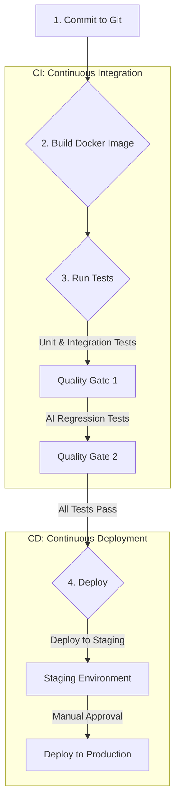
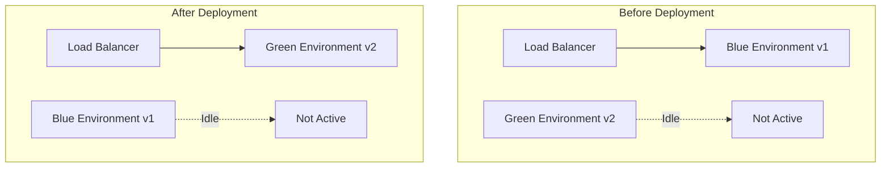

# Chapter 25: Deployment and DevOps for AI Applications

You have designed a robust architecture, engineered brilliant prompts, and built a sophisticated AI application on your local machine. Now comes the final, critical hurdle: moving from the comfort of `localhost` to the unpredictable reality of a live production environment. This is the realm of DevOps—the set of practices that combines software development and IT operations to shorten the development lifecycle and provide continuous delivery with high software quality.

Deploying an AI application, however, introduces unique challenges not found in traditional software. You are not just deploying code; you are deploying models, prompts, and a system whose behavior can be non-deterministic. A simple code change can be rolled back, but how do you "roll back" a model that has started generating harmful content? How do you A/B test a new system prompt without taking down your service?

This chapter is your guide to building a modern, automated, and safe DevOps pipeline for your AI applications. We will cover everything from containerization and CI/CD to advanced deployment strategies like blue-green deployments and the single most important technique for managing AI in production: feature flags.

### Learning Objectives

By the end of this chapter, you will be able to:

-   Design and implement a complete CI/CD pipeline for an AI application.
-   Manage development, staging, and production environments effectively.
-   Implement zero-downtime deployment strategies like Blue-Green deployment.
-   Use **feature flags** to safely roll out new models and prompts.
-   Design and execute safe rollback strategies for both code and AI models.
-   Build a complete, production-ready IoT firmware update system that uses AI for canary analysis.

## The Foundation: A CI/CD Pipeline for AI

A Continuous Integration/Continuous Deployment (CI/CD) pipeline automates the process of testing and deploying your application. For an AI application, the pipeline needs to handle both code and AI-specific artifacts.



### Stage 1: Containerization with Docker

The first step is to package your application into a **Docker container**. A container bundles your code, libraries, and all dependencies into a single, portable image. This ensures that the application runs exactly the same way on your machine, in the testing environment, and in production.

Here's a `Dockerfile` for a typical FastAPI application:

```dockerfile
# Dockerfile

# 1. Use an official Python runtime as a parent image
FROM python:3.11-slim

# 2. Set the working directory in the container
WORKDIR /app

# 3. Copy the requirements file and install dependencies
COPY requirements.txt .
RUN pip install --no-cache-dir -r requirements.txt

# 4. Copy the rest of your application code into the container
COPY . .

# 5. Expose the port the app runs on
EXPOSE 8000

# 6. Define the command to run your application
CMD ["uvicorn", "main:app", "--host", "0.0.0.0", "--port", "8000"]
```

### Stage 2: Automated Testing in the Pipeline

This is the most critical stage for AI applications. Your pipeline must run multiple layers of tests.

1.  **Unit & Integration Tests:** These are the fast, deterministic tests we wrote in Chapter 24. They use mocks to verify your application's logic without making real AI calls.
2.  **AI Regression Tests:** This is the AI quality gate. The pipeline runs your "golden dataset" against a **staging version** of the AI model. An "AI Judge" then scores the new responses. If the average score drops below a certain threshold (e.g., 8/10), the build fails, preventing a quality degradation from reaching production.

### Stage 3: A GitHub Actions CI/CD Workflow

Let's put this together in a `workflow.yaml` file for GitHub Actions, a popular CI/CD platform.

```yaml
# .github/workflows/main.yml
name: AI Application CI/CD

on:
  push:
    branches: [ "main" ]

jobs:
  build-and-test:
    runs-on: ubuntu-latest
    
    steps:
    - name: Checkout repository
      uses: actions/checkout@v3

    - name: Set up Python
      uses: actions/setup-python@v4
      with:
        python-version: '3.11'

    - name's: Install dependencies
      run: |
        python -m pip install --upgrade pip
        pip install -r requirements.txt

    - name: Run Unit & Integration Tests
      run: pytest tests/unit --mock # Run tests that use mocks

    - name: Run AI Regression Tests
      env:
        OPENAI_API_KEY: ${{ secrets.OPENAI_STAGING_KEY }} # Use a separate key for staging
      run: pytest tests/regression # Run tests that make real AI calls to a staging model

  deploy-to-staging:
    needs: build-and-test
    runs-on: ubuntu-latest
    environment: staging
    
    steps:
    - name: Deploy to Staging Environment
      # Add your deployment script here (e.g., using kubectl, docker-compose, etc.)
      run: echo "Deploying to staging..."

  deploy-to-production:
    needs: deploy-to-staging
    runs-on: ubuntu-latest
    environment: production
    
    steps:
    - name: Deploy to Production
      # This step often requires manual approval in the GitHub Actions UI
      run: echo "Deploying to production..."
```

## Environment Management: Dev, Staging, and Production

A professional workflow uses separate environments to prevent breaking the live application.

-   **Development (`dev`):** Your local machine. You use `.env` files for API keys and can connect to cheaper models or even local LLMs to save costs.
-   **Staging (`staging`):** A perfect mirror of the production environment. This is where you test new prompts and models with real API calls against your golden dataset before they go live. It should use its own set of API keys and database.
-   **Production (`prod`):** The live application that serves users. It should use a secure secrets manager for API keys and be monitored 24/7.

Your application code can select the correct configuration based on an environment variable.

```python
# config.py
import os

class Config:
    def __init__(self):
        self.environment = os.getenv("APP_ENV", "development")
        self.openai_api_key = self._get_api_key()
        self.model_name = self._get_model_name()
    
    def _get_api_key(self):
        if self.environment == "production":
            # In production, fetch from a secrets manager
            return get_secret_from_cloud("OPENAI_PROD_KEY")
        return os.getenv("OPENAI_API_KEY") # Loaded from .env locally

    def _get_model_name(self):
        if self.environment == "development":
            return "gpt-4o-mini" # Use a cheaper model for dev
        return "gpt-4o" # Use the powerful model for staging and prod
```

## Advanced Deployment Strategies

Simply stopping the old version of your application and starting the new one leads to downtime. Production systems use more sophisticated strategies.

### Blue-Green Deployment

This is a zero-downtime deployment technique. You have two identical production environments: "Blue" and "Green."



**Workflow:**
1.  The `Blue` environment is currently live, serving all user traffic.
2.  You deploy the new version of your application to the `Green` environment.
3.  You run health checks and smoke tests on the `Green` environment while it's not receiving any live traffic.
4.  Once you're confident it's working, you update your load balancer or router to send all new traffic to `Green`.
5.  `Blue` is now idle but kept running as an immediate rollback target. If anything goes wrong, you just switch the router back to `Blue`.

### Feature Flags: The Ultimate AI Safety Net

**Feature flags (or feature toggles)** are the single most important deployment pattern for AI applications. They allow you to change your application's behavior *without deploying new code*. A feature flag is essentially a remote-controlled `if/else` statement in your code.

Services like LaunchDarkly, Optimizely, or your own Redis-based implementation allow you to control these flags from a central dashboard.

**Why are they critical for AI?**
-   **Model Rollouts:** You can gradually roll out a new, more expensive model (e.g., GPT-4o) to a small percentage of users (e.g., 1%) to monitor its performance and cost before a full release.
-   **Prompt A/B Testing:** You can serve two different prompts to two different sets of users and compare the results to see which performs better.
-   **Emergency Kill Switch:** If an AI model starts generating harmful or nonsensical content, you can instantly disable the feature for all users from a dashboard, without needing an emergency code deployment.

Here's how you'd implement a feature flag for model selection:

```python
# feature_flags.py
import random

class FeatureFlagManager:
    """A simple feature flag manager (in production, use a service like LaunchDarkly)."""
    def __init__(self):
        # These values would be fetched from a remote service or Redis.
        self.flags = {
            "use-new-ai-model": {
                "enabled": True,
                "rollout_percentage": 50 # Roll out to 50% of users
            },
            "experimental-prompt": {
                "enabled": False
            }
        }

    def is_enabled(self, flag_name: str, user_id: str) -> bool:
        flag = self.flags.get(flag_name)
        if not flag or not flag["enabled"]:
            return False
        
        # Consistent rollout based on user ID
        rollout = flag.get("rollout_percentage", 100)
        # Simple hash-based bucketing
        user_bucket = hash(user_id) % 100
        return user_bucket < rollout

# --- In your application code ---
feature_flags = FeatureFlagManager()

def get_analysis_model(user_id: str) -> str:
    """Selects an AI model based on a feature flag."""
    if feature_flags.is_enabled("use-new-ai-model", user_id):
        print(f"User {user_id} gets the new model!")
        return "gpt-4o"
    else:
        print(f"User {user_id} gets the stable model.")
        return "gpt-4o-mini"

# Simulate requests from two different users
print(f"Model for user_123: {get_analysis_model('user_123')}")
print(f"Model for user_456: {get_analysis_model('user_456')}")
```

## Rollback Strategies: Undoing Mistakes

When a deployment goes wrong, you need a plan to revert to the last known good state quickly.

-   **Code Rollback:** With a blue-green strategy, this is instantaneous. You just point the router back to the `Blue` environment.
-   **Model/Prompt Rollback:** This is where feature flags are invaluable. If you roll out a new prompt that performs poorly, you don't need to redeploy your entire application. You simply go to your feature flag dashboard and turn the flag off or set the rollout percentage to 0%. The change takes effect instantly, reverting all users to the old, stable prompt.

## Practical Project: AI-Powered IoT Firmware Update System

Let's build a system that encapsulates these DevOps principles. The task is to safely deploy a new firmware version to a fleet of IoT devices. Deploying bad firmware can "brick" thousands of devices, so safety is paramount. Our system will use AI for **canary analysis**—analyzing the performance of the new firmware on a small subset of devices before rolling it out to everyone.

```python
# safe_firmware_deployer.py
import openai
import time
import random
from typing import Dict

class FeatureFlagManager:
    """Simple feature flag manager."""
    def __init__(self):
        self.flags = {
            "use_experimental_risk_analyzer": {"enabled": True, "rollout_percentage": 100}
        }
    def is_enabled(self, flag_name: str) -> bool:
        return self.flags.get(flag_name, {}).get("enabled", False)

class AICanaryAnalyzer:
    """Uses AI to analyze the risk of a new firmware version."""
    def __init__(self, client, feature_flags: FeatureFlagManager):
        self.client = client
        self.feature_flags = feature_flags

    def analyze_risk(self, firmware_version: str, canary_logs: str) -> Dict:
        """Analyzes logs from canary devices to assess new firmware risk."""
        if self.feature_flags.is_enabled("use_experimental_risk_analyzer"):
            model = "gpt-4o"
            prompt_version = "experimental_v2"
        else:
            model = "gpt-4o-mini"
            prompt_version = "stable_v1"

        print(f"-> Using AI risk analyzer: {prompt_version} with model {model}")

        prompt = f"""
You are a firmware quality assurance expert. Analyze the performance logs from a small 'canary' group of devices running new firmware '{firmware_version}'.

**Canary Device Logs:**
{canary_logs}

Based on these logs, assess the risk of a fleet-wide deployment.
Respond with a JSON object: {{"risk_level": "one of [Low, Medium, High, Critical]", "issues_found": ["list of issues"], "recommendation": "one of [Proceed, Monitor, Abort]"}}
"""
        response = self.client.chat.completions.create(
            model=model,
            messages=[{"role": "user", "content": prompt}],
            response_format={"type": "json_object"}
        )
        return json.loads(response.choices[0].message.content)

class DeploymentOrchestrator:
    """Manages the safe deployment of firmware."""
    def __init__(self):
        self.client = openai.OpenAI()
        self.feature_flags = FeatureFlagManager()
        self.analyzer = AICanaryAnalyzer(self.client, self.feature_flags)

    def deploy_firmware(self, firmware_version: str, total_devices: int):
        print(f"\n--- Starting deployment for firmware {firmware_version} to {total_devices} devices ---")
        
        # 1. Canary Deployment: Deploy to a small subset (e.g., 5% of devices)
        canary_count = max(1, int(total_devices * 0.05))
        print(f"Step 1: Deploying to {canary_count} canary devices...")
        time.sleep(2) # Simulate deployment
        print("Canary deployment complete. Monitoring for 1 hour...")
        
        # 2. Collect logs from canary devices
        time.sleep(1) # Simulate log collection
        canary_logs = f"Firmware v{firmware_version}: {canary_count} devices online. 1 device reported 5% higher battery drain. No critical errors."
        
        # 3. AI Canary Analysis
        print("Step 2: Performing AI Canary Analysis...")
        risk_assessment = self.analyzer.analyze_risk(firmware_version, canary_logs)
        print(f"AI Risk Assessment: {risk_assessment}")
        
        # 4. Make a decision based on AI analysis
        recommendation = risk_assessment.get("recommendation", "Abort")
        
        if recommendation == "Proceed":
            print("Step 3: AI analysis indicates low risk. Proceeding with full rollout.")
            # ... full deployment logic ...
        elif recommendation == "Monitor":
            print("Step 3: AI analysis suggests caution. Extending canary phase for 24 hours.")
            # ... logic to continue monitoring ...
        else: # Abort
            print("Step 3: AI analysis recommends aborting. Rolling back canary devices.")
            # ... rollback logic ...

        print("--- Deployment process complete ---")

# --- Run the Safe Deployment ---
orchestrator = DeploymentOrchestrator()
orchestrator.deploy_firmware(firmware_version="v2.5.1", total_devices=1000)
```
This system provides a robust safety net. The AI acts as an expert QA engineer, analyzing the initial rollout's impact. The feature flag allows you to test new risk analysis prompts without affecting the core deployment logic. The orchestrator makes a final, informed decision, blending automated deployment with intelligent risk assessment.

## Conclusion

DevOps for AI is a specialized discipline that extends traditional practices to manage the unique nature of AI models and prompts. By building automated CI/CD pipelines with AI-specific quality gates, managing your environments carefully, and leveraging advanced deployment strategies, you can build and maintain AI applications with confidence.

Remember the key patterns:
-   **Automate Everything:** Your CI/CD pipeline is your foundation for quality and speed.
-   **Isolate Environments:** Keep dev, staging, and prod separate to prevent accidents.
-   **Deploy with Zero Downtime:** Use Blue-Green deployments for seamless updates.
-   **Use Feature Flags for AI:** This is your most powerful tool for safely testing, rolling out, and rolling back models and prompts.

By embracing these principles, you are not just deploying code; you are orchestrating the continuous delivery of intelligence itself.

# References and Further Reading

- [AI for Dev & DevOps | AWS Solutions for Artificial Intelligence](https://aws.amazon.com/solutions/ai/ai-dev-devops/)
- [Best Practices for Deploying AI Models in Production (Capella Solutions, 2024)](https://www.capellasolutions.com/blog/best-practices-for-deploying-ai-models-in-production)
- [AI deployments best practices (Octopus Deploy, 2024)](https://octopus.com/blog/ai-deployments)
- [Future AI Deployment: Automating Full Lifecycle Management with Rollback Strategies and Cloud Migration (DEV.to, 2025)](https://dev.to/prabhucse/future-ai-deployment-automating-full-lifecycle-management-with-rollback-strategies-and-cloud-34on)
- [How to Deploy an AI Model to Production Using AWS, GCP, or Azure (DEV.to, 2025)](https://dev.to/raji_moshood_ee3a4c2638f6/how-to-deploy-an-ai-model-to-production-using-aws-gcp-or-azure-3dam)