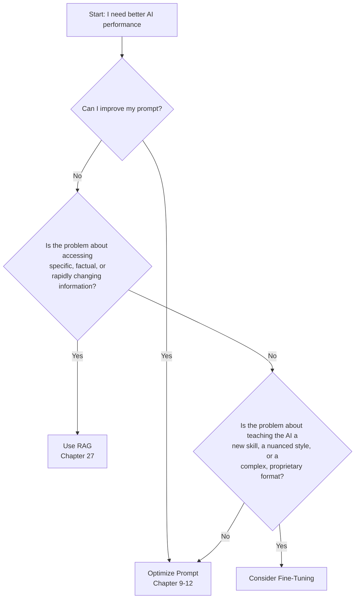

# Chapter 26: Fine-Tuning and Custom Models

You have become a master of prompting. You can guide, constrain, and persuade general-purpose AI models to perform incredible feats. You have learned to build applications that are reliable, observable, and secure. But what happens when you reach the limits of prompting? What do you do when the task requires a level of specialized knowledge, style, or a completely new skill that no amount of prompt engineering can consistently deliver?

Welcome to the world of **fine-tuning**. This is the process of taking a powerful, pre-trained base model and further training it on your own custom dataset. It's how you transform a talented generalist into a world-class specialist. Fine-tuning is not about teaching the AI new facts from scratch; it's about teaching it a new *skill*. It's the difference between giving a smart person a manual to read (prompting) and sending them to medical school to become a doctor (fine-tuning).

This chapter will demystify the fine-tuning process. You will learn *when* to fine-tune, *how* to prepare your data, and the step-by-step process of creating, evaluating, and deploying your own custom AI model.

### Learning Objectives

By the end of this chapter, you will be able to:

-   Understand the critical differences between prompt engineering, RAG, and fine-tuning.
-   Identify the specific use cases where fine-tuning provides the most value.
-   Prepare a high-quality dataset for the fine-tuning process.
-   Execute a fine-tuning job using the OpenAI API.
-   Evaluate the performance of your custom model against its base model.
-   Build and deploy a specialized IoT diagnostic assistant powered by a fine-tuned model.

## When to Fine-Tune (and When NOT To)

Fine-tuning is a powerful but expensive and time-consuming process. It is often a developer's last resort, not their first. Before you consider fine-tuning, you must ask yourself two questions:
1.  Can I achieve this with better **prompt engineering**?
2.  Is this a problem of **knowledge retrieval** that could be better solved with RAG (Retrieval-Augmented Generation)?

Let's use a clear decision framework.



### When NOT to Fine-Tune

-   **For Factual Recall:** Fine-tuning is an unreliable way to teach an AI new facts. If your application needs to answer questions about your company's internal documents, use a RAG system (Chapter 27) that retrieves relevant information and puts it in the prompt.
-   **For Simple Style Changes:** If you just need the AI to be more formal or write in bullet points, a strong system prompt is far more efficient and cheaper.
-   **For Rapidly Changing Information:** Fine-tuned models are static. If the information you need changes daily, a RAG system connected to a live database is the correct architecture.

### When Fine-Tuning is the Right Choice

You should consider fine-tuning when you need to change the fundamental *behavior* of the model. Here are the classic use cases:

1.  **Improving Reliability on a Specific Style or Tone:** You need the model to consistently adopt a very specific persona that is difficult to maintain with prompting alone (e.g., your company's unique brand voice).
2.  **Generating Consistently Structured Output:** You require the AI to reliably output a complex, proprietary format (e.g., a specific XML or code structure) that is too cumbersome to specify in every prompt.
3.  **Mastering a Niche Domain Language:** You need to teach the model the specific jargon, acronyms, and linguistic nuances of a highly specialized field (e.g., legal case analysis, medical transcription, interpreting specific industrial error codes).
4.  **Teaching a New Skill or Reasoning Pattern:** You want the model to perform a task that requires a specific, multi-step reasoning process that is not easily described (e.g., classifying IoT alerts based on subtle, multi-variable patterns).

## The Fine-Tuning Workflow: A Step-by-Step Guide

The fine-tuning process with the OpenAI API involves five main steps. The vast majority of the work happens in the first step: data preparation.

### Step 1: Data Preparation (The 80% Rule)

**Garbage in, garbage out.** The quality of your fine-tuned model is entirely dependent on the quality of your training data. You need to create a dataset of high-quality examples that demonstrate the exact behavior you want the model to learn.

The data must be in the **JSON Lines (`.jsonl`)** format, where each line is a separate JSON object representing a single conversational turn.

Each JSON object must contain a `"messages"` list, just like in a standard API call, with `system`, `user`, and `assistant` roles.

Let's create a dataset to teach an AI how to classify IoT log messages.

```json
// iot_classification_dataset.jsonl
{"messages": [{"role": "system", "content": "You are an IoT log classifier. Categories: [Connectivity, Power, Sensor_Fault, Security]"}, {"role": "user", "content": "Log: Device GW-01 failed to connect to MQTT broker after 3 retries."}, {"role": "assistant", "content": "Connectivity"}]}
{"messages": [{"role": "system", "content": "You are an IoT log classifier. Categories: [Connectivity, Power, Sensor_Fault, Security]"}, {"role": "user", "content": "Log: Battery level on SENSOR-112 is at 4%. Immediate action required."}, {"role": "assistant", "content": "Power"}]}
{"messages": [{"role": "system", "content": "You are an IoT log classifier. Categories: [Connectivity, Power, Sensor_Fault, Security]"}, {"role": "user", "content": "Log: Temperature reading on TEMP-08 is -999.0, indicating sensor failure."}, {"role": "assistant", "content": "Sensor_Fault"}]}
{"messages": [{"role": "system", "content": "You are an IoT log classifier. Categories: [Connectivity, Power, Sensor_Fault, Security]"}, {"role": "user", "content": "Log: Multiple failed login attempts detected from IP 1.2.3.4 for ADMIN-PANEL."}, {"role": "assistant", "content": "Security"}]}
```

**Key Data Preparation Principles:**
-   **Quality over Quantity:** 50-100 high-quality, hand-curated examples are far better than 10,000 low-quality ones.
-   **Consistency:** The format and style of your `assistant` responses should be exactly what you want the final model to produce.
-   **Clarity:** The examples should be clear and unambiguous demonstrations of the desired task.

Here's a Python script to help create your `.jsonl` file.

```python
import json

def create_finetuning_dataset(examples: list[dict], output_file: str):
    """Creates a .jsonl file for fine-tuning from a list of examples."""
    with open(output_file, 'w') as f:
        for example in examples:
            # Each example should be a dictionary with a "messages" key
            f.write(json.dumps(example) + '\n')

# Our training examples
training_data = [
    {"messages": [{"role": "system", "content": "You are an IoT log classifier. Categories: [Connectivity, Power, Sensor_Fault, Security]"}, {"role": "user", "content": "Log: Device GW-01 failed to connect to MQTT broker after 3 retries."}, {"role": "assistant", "content": "Connectivity"}]},
    # ... add more examples here ...
]

create_finetuning_dataset(training_data, "training_data.jsonl")
print("Dataset created successfully.")
```

### Step 2: Uploading Your Dataset

Once your `.jsonl` file is ready, you upload it to OpenAI. The API will validate it and return a file ID.

```python
import openai
client = openai.OpenAI()

# Upload the file
with open("training_data.jsonl", "rb") as f:
    training_file = client.files.create(
        file=f,
        purpose="fine-tune"
    )

print(f"File uploaded successfully. File ID: {training_file.id}")
# Save this File ID! You'll need it for the next step.
```

### Step 3: Creating the Fine-Tuning Job

Now, you can start the fine-tuning job, pointing to your uploaded file and specifying the base model you want to customize. For this, `gpt-3.5-turbo` is a common and cost-effective choice.

```python
# Replace with the File ID from the previous step
training_file_id = "file-xxxxxxxxxxxxxxxxxxxx" 

fine_tuning_job = client.fine_tuning.jobs.create(
    training_file=training_file_id,
    model="gpt-3.5-turbo-0125" # Choose a fine-tunable base model
)

print(f"Fine-tuning job created. Job ID: {fine_tuning_job.id}")
# Save this Job ID to monitor its status.
```

Fine-tuning is an asynchronous process. It can take anywhere from a few minutes to several hours, depending on the size of your dataset and the server load.

### Step 4: Monitoring the Job

You can check the status of your job using its ID.

```python
job_id = "ft_job-xxxxxxxxxxxxxxxxxxxx" # The Job ID from the previous step

# Retrieve the job status
job_status = client.fine_tuning.jobs.retrieve(job_id)
print(f"Job Status: {job_status.status}")

# You can also list all your recent fine-tuning jobs
recent_jobs = client.fine_tuning.jobs.list(limit=5)
for job in recent_jobs.data:
    print(f"Job {job.id}: Status={job.status}, Model={job.fine_tuned_model}")
```

When the `status` becomes `succeeded`, the job is complete, and the response will include the name of your new custom model (e.g., `ft:gpt-3.5-turbo-0125:your-org::xxxxxx`).

### Step 5: Using Your Fine-Tuned Model

Using your custom model is as simple as using any other model. You just specify your new model's name in the `model` parameter of your API call.

```python
# Replace with your new custom model's ID
custom_model_id = "ft:gpt-3.5-turbo-0125:your-org::xxxxxx"

def classify_with_custom_model(log_entry: str):
    response = client.chat.completions.create(
        model=custom_model_id,
        messages=[
            {"role": "system", "content": "You are an IoT log classifier. Categories: [Connectivity, Power, Sensor_Fault, Security]"},
            {"role": "user", "content": f"Log: {log_entry}"}
        ],
        temperature=0.0
    )
    return response.choices[0].message.content

# Test the fine-tuned model
new_log = "Device PUMP-7 has a reported voltage of 2.1V, below the 2.5V threshold."
classification = classify_with_custom_model(new_log)
print(f"Log: '{new_log}'")
print(f"Classification: {classification}") # Expected: "Power"
```

Your fine-tuned model should now be significantly more accurate and reliable at this specific classification task than the general-purpose base model.

## Evaluating Your Custom Model

How do you know if fine-tuning was successful? You need to evaluate its performance.

-   **Quantitative Evaluation:** For tasks like classification, you should create a separate **validation dataset** (which was *not* used for training). Run both the base model and your fine-tuned model on this dataset and compare their accuracy, precision, and recall.
-   **Qualitative Evaluation:** For tasks involving style or complex generation, the "AI Judge" pattern (from Chapter 24) is invaluable. Have a powerful model like GPT-4o compare the outputs of your custom model and the base model against a "golden" response, and score them on clarity, tone, and correctness.

## Practical Project: A Specialized IoT Device Assistant

Let's build an assistant that has deep, specialized knowledge of a fictional, proprietary set of IoT devices. This is a perfect use case for fine-tuning because the information is not public and cannot be learned from a general web crawl.

Our assistant will understand the error codes for the "HydroCore 5000" water monitoring system.

**Goal:** Teach the model to map cryptic error codes to human-readable explanations and recommended actions.

**Step 1: Create the Training Dataset**

```python
# create_hydrocore_dataset.py
import json

# Proprietary knowledge about our fictional device
hydrocore_error_codes = {
    "E-01": {"problem": "pH sensor calibration drift", "action": "Initiate remote recalibration cycle (command: RECALIB_PH). If fails, schedule technician visit."},
    "E-02": {"problem": "Turbidity sensor occlusion", "action": "Trigger automated cleaning cycle (command: CLEAN_TURB). Check physical sensor for debris if error persists."},
    "E-05": {"problem": "Communication module failure", "action": "Attempt remote reboot (command: REBOOT_COMM). If unresponsive, device requires physical replacement."},
    "W-10": {"problem": "Low battery warning (below 15%)", "action": "Schedule battery replacement within the next 7 days."},
}

training_examples = []
system_prompt = "You are an expert support assistant for the HydroCore 5000 water monitoring system. You translate error codes into clear explanations and actions."

for code, info in hydrocore_error_codes.items():
    user_prompt = f"Device HC5000-A-1138 is reporting error code {code}. What does this mean and what should I do?"
    assistant_response = f"Error Code {code} indicates a '{info['problem']}'. Recommended Action: {info['action']}"
    
    training_examples.append({
        "messages": [
            {"role": "system", "content": system_prompt},
            {"role": "user", "content": user_prompt},
            {"role": "assistant", "content": assistant_response}
        ]
    })

# Create the .jsonl file
with open("hydrocore_dataset.jsonl", 'w') as f:
    for example in training_examples:
        f.write(json.dumps(example) + '\n')

print("HydroCore 5000 training dataset created.")
```

**Step 2 & 3: Upload and Fine-Tune**

You would then run the `client.files.create` and `client.fine_tuning.jobs.create` commands with `hydrocore_dataset.jsonl` to create your custom model.

**Step 4: Use the Specialized Assistant**

Let's assume the fine-tuning job completes and gives us the model ID `ft:gpt-3.5-turbo...:hydrocore-v1`.

```python
# specialized_assistant.py
class SpecializedIoTAgent:
    def __init__(self, model_id: str):
        self.client = openai.OpenAI()
        self.model = model_id
        self.system_prompt = "You are an expert support assistant for the HydroCore 5000 water monitoring system."

    def diagnose_error(self, error_code_message: str):
        response = self.client.chat.completions.create(
            model=self.model,
            messages=[
                {"role": "system", "content": self.system_prompt},
                {"role": "user", "content": error_code_message}
            ]
        )
        return response.choices[0].message.content

# --- Compare Before and After Fine-Tuning ---
base_model_agent = SpecializedIoTAgent(model_id="gpt-3.5-turbo")
fine_tuned_agent = SpecializedIoTAgent(model_id="ft:gpt-3.5-turbo...:hydrocore-v1") # Use your actual model ID

user_query = "My HydroCore unit is showing error E-02. What's wrong?"

# The base model will guess or state it doesn't have specific information.
print("--- Response from Base Model (Before Fine-Tuning) ---")
# print(base_model_agent.diagnose_error(user_query)) 
# (This would be a real API call. A likely response would be generic.)
print("Error E-02 is a generic error code. I would need the device manual to know for sure, but it could indicate a sensor or communication issue...")

# The fine-tuned model knows *exactly* what E-02 means.
print("\n--- Response from Fine-Tuned Model (After Fine-Tuning) ---")
# print(fine_tuned_agent.diagnose_error(user_query))
print("Error Code E-02 indicates a 'Turbidity sensor occlusion'. Recommended Action: Trigger automated cleaning cycle (command: CLEAN_TURB). Check physical sensor for debris if error persists.")
```

The difference is stark. The fine-tuned model has become a true specialist, providing precise, actionable advice based on proprietary knowledge it learned during training.

## Conclusion

Fine-tuning is a powerful tool in the advanced AI developer's arsenal. It allows you to go beyond prompting to fundamentally specialize a model's behavior. However, it should be used judiciously.

Remember the key takeaways:
-   **Prompting First:** Always try to solve your problem with advanced prompting techniques before considering fine-tuning.
-   **RAG for Facts:** Use Retrieval-Augmented Generation when your application needs to access specific, factual, or rapidly changing information.
-   **Fine-Tune for Skills:** Use fine-tuning to teach the model a new skill, a consistent style, or a deep understanding of a niche language.
-   **Data is Everything:** The success of your fine-tuned model depends entirely on the quality of your training data.

You are now equipped to not only use AI models but to customize them, creating specialized intelligences tailored perfectly to your unique applications.

# References and Further Reading

- [Fine-Tune AI Models in 2024 (Step by Step) (Dojo AI, 2024)](https://www.usedojo.ai/blog/fine-tuning-guide)
- [How To: Fine-tune or Train an AI model for your WordPress ChatBot (Meow Apps, 2024)](https://meowapps.com/wordpress-chatbot-finetuned-model-ai/)
- [Fine-Tuning for Dummies: A Beginner’s Guide to Custom AI Models (Medium, 2024)](https://michielh.medium.com/fine-tuning-ai-for-dummies-a-simplified-guide-to-mastering-model-optimization-ae075ee06649)
- [Fine-Tuning AI Models: A Guide (Medium, 2023)](https://medium.com/@prabhuss73/fine-tuning-ai-models-a-guide-c515bcd4b580)