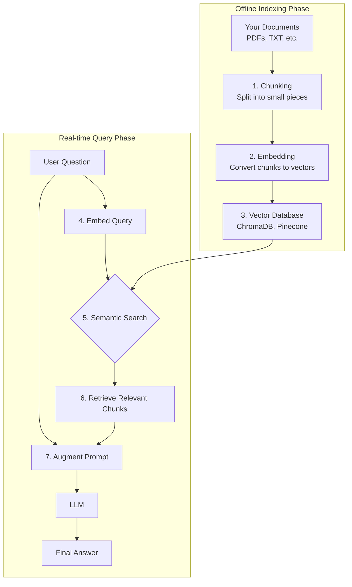

# Chapter 27: Retrieval-Augmented Generation (RAG)

In the last chapter, we learned how to specialize an AI by fine-tuning it on custom data. Fine-tuning is incredibly powerful for teaching an AI a new *skill* or *style*. However, it is an inefficient and often ineffective way to teach an AI new *knowledge*. A fine-tuned model's knowledge is static—it's frozen at the moment its training completes. It cannot learn about events that happened yesterday, nor can it access your company's private, proprietary documents.

So, how do we build an AI that can reason using up-to-the-minute information or a specific, private knowledge base? The answer is a powerful architectural pattern called **Retrieval-Augmented Generation (RAG)**. RAG is arguably the most important technique for building modern, knowledge-intensive AI applications. It is the bridge between the static, general knowledge of an LLM and the dynamic, specific information of the real world.

### Learning Objectives

By the end of this chapter, you will be able to:

-   Understand the core concept of RAG and why it's a game-changer for AI applications.
-   Grasp the complete RAG workflow: indexing, retrieval, and augmented generation.
-   Implement each stage of a RAG system from scratch using Python.
-   Use vector databases like ChromaDB for efficient semantic search.
-   Build a complete RAG-powered assistant capable of answering questions about custom documents.
-   Make an informed decision between using RAG, fine-tuning, or a combination of both.

## The Problem: The Amnesiac Genius

An out-of-the-box LLM is like a genius who has read every book in the library up to last year but has no memory of anything specific to you or your business. It can tell you about the general principles of IoT, but it knows nothing about *your* specific IoT device, the "HydroCore 5000."

Let's demonstrate this limitation.

```python
import openai
client = openai.OpenAI()

def ask_about_specific_device(question: str):
    """Asks a question about a specific, fictional device."""
    
    # This prompt is destined to fail because the model has never heard of the HydroCore 5000.
    response = client.chat.completions.create(
        model="gpt-4o-mini",
        messages=[
            {"role": "system", "content": "You are a helpful support agent."},
            {"role": "user", "content": question}
        ]
    )
    return response.choices[0].message.content

question = "What is the standard operating pressure for the HydroCore 5000 water pump?"
answer = ask_about_specific_device(question)
print(answer)
```
The AI will politely inform you that it has no information about a "HydroCore 5000," as this device does not exist in its public training data. This is where RAG comes in.

## The RAG Solution: Open-Book Exams for AI

RAG transforms the task from a "closed-book exam," where the AI must rely solely on its internal memory, to an "open-book exam." Before answering a question, the AI is given a cheat sheet of relevant information retrieved from your private knowledge base.

The RAG workflow consists of two main phases:

1.  **Indexing (Offline Process):** You process your knowledge base (e.g., product manuals, PDFs, text files) into a searchable format.
2.  **Retrieval & Generation (Real-time Process):** When a user asks a question, you retrieve relevant information from your knowledge base and provide it to the AI along with the user's original question.



Let's build this system, one step at a time.

## Building a RAG System From Scratch

We will build a RAG system that can answer questions about our fictional HydroCore 5000 device by giving it access to the device's manual.

First, create a text file named `hydrocore_manual.txt`:

```text
# hydrocore_manual.txt

--- HydroCore 5000 Product Manual ---

Section 1: Overview
The HydroCore 5000 is an industrial-grade water pump designed for high-pressure systems. Its standard operating pressure is between 150 and 200 PSI.

Section 2: Safety
WARNING: Never operate the pump above 220 PSI, as this can cause catastrophic failure. The emergency shutoff engages automatically at 225 PSI.

Section 3: Troubleshooting
Error Code E-01: Low Pressure. Check for leaks in the intake line.
Error Code E-04: High Motor Temperature. The motor temperature should not exceed 85°C. Check the cooling fan and ensure proper ventilation.
```

### Step 1: The Indexing Pipeline

This is the "offline" phase where we prepare our knowledge base. It involves loading, chunking, and embedding our documents.

**1a. Loading and Chunking Documents**

We can't feed the entire manual to the AI at once due to context window limitations. More importantly, we want to find the *most relevant small pieces* of the manual to answer a specific question. So, we split the document into smaller "chunks."

We'll use libraries from the `langchain-community` ecosystem for this, as they provide convenient helpers.
```bash
pip install langchain-community
```

```python
from langchain_community.document_loaders import TextLoader
from langchain_text_splitters import RecursiveCharacterTextSplitter

def load_and_chunk_document(file_path: str, chunk_size: int = 500, chunk_overlap: int = 50) -> list:
    """Loads a text document and splits it into smaller chunks."""
    print(f"Loading document from: {file_path}")
    loader = TextLoader(file_path)
    documents = loader.load()
    
    text_splitter = RecursiveCharacterTextSplitter(
        chunk_size=chunk_size,
        chunk_overlap=chunk_overlap
    )
    
    chunks = text_splitter.split_documents(documents)
    print(f"Document split into {len(chunks)} chunks.")
    return chunks

# Let's process our manual
document_chunks = load_and_chunk_document("hydrocore_manual.txt")
print("\n--- Example Chunk ---")
print(document_chunks[0].page_content)
```

**1b. Creating Embeddings and Storing in a Vector Database**

Now that we have our chunks, we need a way to search them based on meaning. As we learned in Chapter 2, we do this with **embeddings**. We will convert each chunk of text into a numerical vector. These vectors will be stored in a **vector database**, which is a special kind of database optimized for finding similar vectors.

For this example, we'll use `ChromaDB`, a popular open-source vector database that can run entirely in memory, making it perfect for development.

```bash
pip install chromadb
```

```python
import chromadb

def create_vector_store(chunks: list, client: openai.OpenAI) -> chromadb.Collection:
    """Creates embeddings for document chunks and stores them in ChromaDB."""
    print("Creating vector store...")
    
    # Initialize ChromaDB client and create a collection
    chroma_client = chromadb.Client()
    collection_name = "iot_manuals"
    # If the collection already exists, delete it for a clean start
    if len(chroma_client.list_collections()) > 0 and collection_name in [c.name for c in chroma_client.list_collections()]:
        chroma_client.delete_collection(name=collection_name)
    
    collection = chroma_client.create_collection(name=collection_name)
    
    # Get the text content from each chunk
    documents_to_embed = [chunk.page_content for chunk in chunks]
    
    # Create embeddings in batches for efficiency
    response = client.embeddings.create(
        model="text-embedding-3-small",
        input=documents_to_embed
    )
    
    embeddings = [item.embedding for item in response.data]
    
    # Store the documents, embeddings, and some metadata in the collection
    collection.add(
        embeddings=embeddings,
        documents=documents_to_embed,
        ids=[f"chunk_{i}" for i in range(len(chunks))] # Each item needs a unique ID
    )
    
    print(f"Vector store created with {collection.count()} entries.")
    return collection

# Let's create our vector store
vector_store = create_vector_store(document_chunks, client)
```

Our indexing pipeline is complete! We now have our product manual stored in a way that allows for efficient semantic search.

### Step 2: The Retrieval and Generation Pipeline

This is the "real-time" phase that happens whenever a user asks a question.

**2a. Retrieving Relevant Context**

First, we take the user's question, create an embedding for it, and use that embedding to query our vector store for the most similar (i.e., most relevant) chunks from the manual.

```python
def retrieve_relevant_chunks(query: str, collection: chromadb.Collection, client: openai.OpenAI, n_results: int = 2) -> list[str]:
    """Retrieves the most relevant document chunks for a given query."""
    print(f"Retrieving relevant chunks for query: '{query}'")
    
    # Create an embedding for the user's query
    query_embedding = client.embeddings.create(
        model="text-embedding-3-small",
        input=[query]
    ).data[0].embedding
    
    # Query the collection for the most similar chunks
    results = collection.query(
        query_embeddings=[query_embedding],
        n_results=n_results
    )
    
    relevant_chunks = results['documents'][0]
    print(f"Found {len(relevant_chunks)} relevant chunks.")
    return relevant_chunks
```

**2b. Augmenting the Prompt and Generating the Final Answer**

This is the final and most crucial step. We construct a new prompt that combines the retrieved context with the user's original question. This gives the AI the "open book" it needs to answer correctly.

```python
def generate_rag_response(query: str, context_chunks: list[str], client: openai.OpenAI) -> str:
    """Generates a final answer using the retrieved context."""
    print("Generating RAG response...")
    
    # Combine the context chunks into a single string
    context_str = "\n\n---\n\n".join(context_chunks)
    
    system_prompt = """
You are a helpful support assistant for the HydroCore 5000.
Answer the user's question based *only* on the provided context.
If the information is not in the context, say that you don't have enough information.
Cite the section of the manual you are using, if possible.
"""
    
    user_prompt = f"""
**Context from Manual:**
{context_str}

---
**User's Question:**
{query}
"""
    
    response = client.chat.completions.create(
        model="gpt-4o-mini",
        messages=[
            {"role": "system", "content": system_prompt},
            {"role": "user", "content": user_prompt},
        ]
    )
    
    return response.choices[0].message.content

# Let's test the full RAG pipeline
user_question = "What is the standard operating pressure for the HydroCore 5000?"

# 1. Retrieve context
context = retrieve_relevant_chunks(user_question, vector_store, client)
print("\n--- Retrieved Context ---")
for i, chunk in enumerate(context):
    print(f"Chunk {i+1}:\n{chunk}\n")

# 2. Generate final answer
final_answer = generate_rag_response(user_question, context, client)
print("--- Final RAG Answer ---")
print(final_answer)
```
The AI now confidently and correctly answers the question, likely even citing the section from the manual, because we provided the necessary knowledge directly in the prompt.

## A Complete RAG Assistant Class

Let's encapsulate this entire workflow into a clean, reusable class.

```python
import openai
import chromadb
from langchain_community.document_loaders import TextLoader
from langchain_text_splitters import RecursiveCharacterTextSplitter

class RAGAssistant:
    def __init__(self, collection_name: str = "default_rag_collection"):
        self.client = openai.OpenAI()
        self.chroma_client = chromadb.Client()
        self.collection_name = collection_name
        
        # Ensure the collection exists
        if len(self.chroma_client.list_collections()) > 0 and self.collection_name in [c.name for c in self.chroma_client.list_collections()]:
             self.collection = self.chroma_client.get_collection(name=self.collection_name)
        else:
             self.collection = self.chroma_client.create_collection(name=self.collection_name)
        
        print(f"RAG Assistant initialized. Collection '{self.collection_name}' has {self.collection.count()} documents.")

    def add_document(self, file_path: str):
        """Loads, chunks, and indexes a new document."""
        # 1. Load and chunk
        loader = TextLoader(file_path)
        documents = loader.load()
        text_splitter = RecursiveCharacterTextSplitter(chunk_size=500, chunk_overlap=50)
        chunks = text_splitter.split_documents(documents)
        
        documents_to_embed = [chunk.page_content for chunk in chunks]
        
        # 2. Create embeddings
        response = self.client.embeddings.create(
            model="text-embedding-3-small",
            input=documents_to_embed
        )
        embeddings = [item.embedding for item in response.data]
        
        # 3. Add to vector store
        new_ids = [f"{file_path}_{i}" for i in range(len(chunks))]
        self.collection.add(embeddings=embeddings, documents=documents_to_embed, ids=new_ids)
        print(f"Added {len(chunks)} chunks from '{file_path}' to the knowledge base.")

    def ask(self, query: str) -> str:
        """Asks a question using the RAG pipeline."""
        
        # 1. Retrieve relevant context
        query_embedding = self.client.embeddings.create(model="text-embedding-3-small", input=[query]).data[0].embedding
        results = self.collection.query(query_embeddings=[query_embedding], n_results=3)
        context_chunks = results['documents'][0]
        
        if not context_chunks:
            return "I'm sorry, I couldn't find any relevant information in my knowledge base to answer that question."
        
        # 2. Generate final response
        context_str = "\n\n---\n\n".join(context_chunks)
        system_prompt = "You are a helpful assistant. Answer the user's question based only on the provided context."
        user_prompt = f"Context:\n{context_str}\n\nQuestion:\n{query}"
        
        response = self.client.chat.completions.create(
            model="gpt-4o-mini",
            messages=[
                {"role": "system", "content": system_prompt},
                {"role": "user", "content": user_prompt},
            ]
        )
        return response.choices[0].message.content

# --- Demo of the RAG Assistant ---
# Initialize the assistant
rag_bot = RAGAssistant("iot_device_docs")

# Add our manual to its knowledge base
rag_bot.add_document("hydrocore_manual.txt")

# Now, ask questions
print("\n--- Asking questions to our RAG-powered bot ---")
print("Q1: What should I do for Error Code E-04?")
print("A1:", rag_bot.ask("What should I do for Error Code E-04?"))

print("\nQ2: What is the maximum safe operating pressure?")
print("A2:", rag_bot.ask("What is the maximum safe operating pressure?"))
```

## RAG vs. Fine-Tuning: The Final Verdict

Now that we understand both techniques, we can establish a clear decision framework.

| Aspect                | Retrieval-Augmented Generation (RAG)                               | Fine-Tuning                                                        |
| --------------------- | ------------------------------------------------------------------ | ------------------------------------------------------------------ |
| **Primary Goal**      | Adding new or private **knowledge**.                               | Teaching a new **skill, style, or format**.                        |
| **How it Works**      | Injects relevant information into the prompt at query time.        | Updates the model's internal weights with new training examples.   |
| **Knowledge Updates** | **Easy & Instant.** Just add/update documents in the vector DB.    | **Hard & Slow.** Requires creating a new dataset and running a new job. |
| **Hallucinations**    | **Reduces hallucinations.** Answers are grounded in provided context. | **Can still hallucinate.** May invent facts in its new learned style. |
| **Cost**              | Cheaper to set up, but has ongoing costs for embeddings and retrieval. | Expensive and time-consuming upfront training, but can be cheaper per call. |
| **Explainability**    | **High.** You can show the user the exact text used to form the answer. | **Low.** It's a black box; you can't see why it gave a specific answer. |
| **Best Use Case**     | Building a Q&A bot over your company's documents.                  | Creating an AI that reliably generates code in your company's specific style. |

**The Modern Approach:** Many advanced systems use a hybrid approach. They **fine-tune** a model to be an expert at a specific task (like summarizing clinical notes), and then use **RAG** to provide it with the specific patient record to summarize at query time.

## Conclusion

Retrieval-Augmented Generation is one of the most impactful patterns in modern AI development. It elegantly solves the problem of knowledge limitation by connecting powerful but generalist LLMs to specific, timely, and private data sources.

You have learned:
-   The complete RAG workflow, from chunking and embedding documents to retrieving context and generating an augmented response.
-   How to use vector databases like ChromaDB to perform efficient semantic search.
-   How to build a modular, reusable RAG assistant from scratch.
-   The critical differences between RAG and fine-tuning, and when to use each.

By mastering RAG, you have unlocked the ability to build AI applications that are not only intelligent but also deeply knowledgeable about the specific domain in which they operate. You can now build AI systems that can answer questions about your products, your code, your business—anything you can write down.

# References and Further Reading

- [An introduction to RAG: Retrieval Augmented Generation explained (Eagerworks, 2024)](https://eagerworks.com/blog/retrieval-augmented-generation)
- [A Comprehensive Guide on What is Retrieval Augmented Generation (RAG) (Rapid Innovation, 2024)](https://www.rapidinnovation.io/post/a-comprehensive-guide-on-what-is-retrieval-augmented-generation)
- [Next-Gen Large Language Models: The Retrieval-Augmented Generation (RAG) Handbook (freeCodeCamp, 2024)](https://www.freecodecamp.org/news/retrieval-augmented-generation-rag-handbook/)
- [A Gentle Introduction to Retrieval Augmented Generation (RAG) (Medium, 2024)](https://medium.com/@anicomanesh/a-gentle-introduction-to-retrieval-augmented-generation-rag-2b4ca39151bd)
- [Introduction to Retrieval-Augmented Generation (RAG) (Medium, 2024)](https://medium.com/@thomaspernet/introduction-to-retrieval-augmented-generation-rag-2b07fa074658)
- [The Complete Overview to Retrieval Augmented Generation (RAG) (GoPenAI, 2023)](https://blog.gopenai.com/the-complete-guide-to-retrieval-augmented-generation-rag-3ce54a57d8be?gi=bf5fa12d8b96)