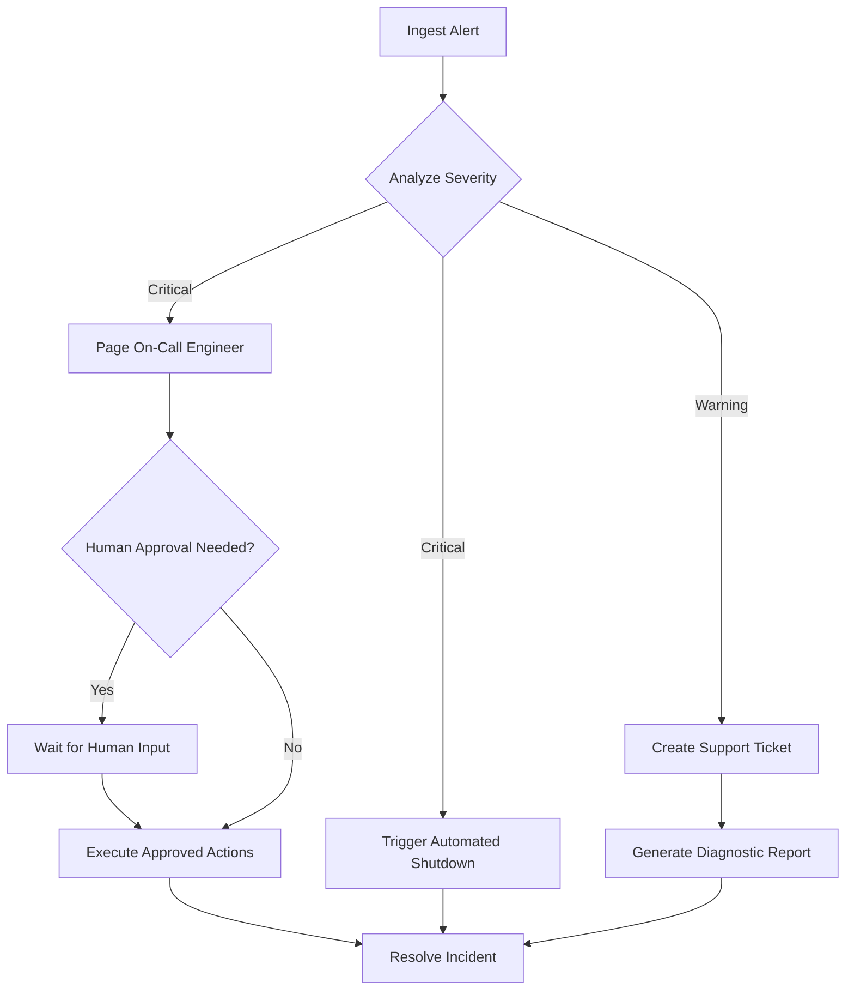

# Chapter 28: AI Workflows and Orchestration

In the preceding chapters, we have built increasingly sophisticated AI systems. We've created agents that can use tools, chains that perform multi-step reasoning, and applications that serve models through robust APIs. However, most of our designs have followed a linear path: a request comes in, a sequence of actions occurs, and a response goes out. But real-world business processes are rarely so simple. They involve branching logic, parallel tasks, human approvals, and error recovery—in other words, they are **workflows**.

This chapter is about graduating from simple AI chains to building robust, automated AI workflows. We will learn how to use **orchestration engines** to manage complex, multi-step processes that involve both AI and traditional software components. We will move beyond single-shot reasoning and design systems that can execute complex business logic, handle failures gracefully, and even incorporate a human in the loop for critical decisions.

### Learning Objectives

By the end of this chapter, you will be able to:

-   Understand the difference between a simple AI chain and a complex workflow.
-   Design AI workflows using Directed Acyclic Graphs (DAGs).
-   Build a simple, from-scratch workflow orchestration engine in Python.
-   Implement error recovery, retries, and conditional logic within your workflows.
-   Integrate **Human-in-the-Loop (HITL)** patterns for critical decision points.
-   Architect a complete, automated IoT incident response workflow.
-   Know when to use a simple script versus a powerful workflow engine like Prefect or Airflow.

## From Simple Chains to Complex Workflows

A simple AI chain is like a straight road. It's efficient for getting from point A to point B, but it offers no detours or alternatives.

```python
def simple_ai_chain(alert_data: str) -> str:
    # 1. Summarize the alert
    summary = ai_summarize(alert_data)
    # 2. Diagnose the root cause
    diagnosis = ai_diagnose(summary)
    # 3. Generate a report
    report = generate_report(diagnosis)
    return report
```
This is fine until something goes wrong. What if the diagnosis is uncertain? What if the alert requires immediate, parallel actions? What if a human needs to approve the final report? A linear chain breaks down under this complexity.

A workflow, by contrast, is like a city map with multiple routes, intersections, and traffic lights. It is a structured graph of tasks where the path of execution can change dynamically based on the outcome of previous steps. The standard way to represent a workflow is with a **Directed Acyclic Graph (DAG)**.

-   **Directed:** Each task flows into the next in a specific direction.
-   **Acyclic:** The workflow doesn't loop back on itself, ensuring it eventually completes.



This DAG represents a much more realistic and robust process than a simple linear chain. Building a system to execute this graph is the job of a **workflow orchestrator**.

## Building a Simple Workflow Orchestrator

To truly understand how workflows operate, we will build a simplified orchestrator from scratch. This will reveal the core mechanics of task dependency, data passing, and state management.

### Step 1: Defining a Task

First, we need a way to define a single unit of work, or a "task." A task needs a function to execute and a list of other tasks it depends on.

```python
from typing import Callable, List, Dict, Any, Set

class Task:
    def __init__(self, task_id: str, function: Callable, dependencies: List[str] = None):
        self.id = task_id
        self.function = function
        self.dependencies = set(dependencies or [])

# Let's define some simple functions to be our tasks
def ingest_data() -> dict:
    print("TASK: Ingesting data...")
    return {"raw_data": "Device T-101 reports temperature at 95°C."}

def analyze_data(ingested_data: dict) -> dict:
    print("TASK: Analyzing data...")
    if "95°C" in ingested_data.get("raw_data", ""):
        return {"severity": "Critical", "details": "Temperature exceeds 90°C limit."}
    return {"severity": "Normal", "details": "All systems nominal."}

def send_alert(analysis_result: dict):
    print(f"TASK: Sending alert... SEVERITY: {analysis_result.get('severity')}")
    print("  -> Alert sent to on-call engineer.")

def log_to_database(analysis_result: dict):
    print(f"TASK: Logging to database... STATUS: {analysis_result.get('severity')}")
    print("  -> Log entry written.")
```

### Step 2: The Orchestrator

The orchestrator's job is to take a set of tasks, understand their dependencies, and execute them in the correct order. The key to this is a **topological sort** of the DAG, which gives us a linear ordering of tasks where every task comes after all of its dependencies.

```python
class WorkflowOrchestrator:
    def __init__(self):
        self.tasks: Dict[str, Task] = {}
        self.task_graph: Dict[str, Set[str]] = {}

    def add_task(self, task: Task):
        """Adds a task to the workflow."""
        self.tasks[task.id] = task
        self.task_graph[task.id] = task.dependencies

    def _topological_sort(self) -> List[str]:
        """Sorts tasks based on their dependencies."""
        sorted_order = []
        visited = set()
        recursion_stack = set()
        
        def visit(task_id):
            visited.add(task_id)
            recursion_stack.add(task_id)
            
            for dep_id in self.task_graph.get(task_id, set()):
                if dep_id not in visited:
                    visit(dep_id)
                elif dep_id in recursion_stack:
                    raise Exception("Circular dependency detected in workflow!")
            
            sorted_order.insert(0, task_id)
            recursion_stack.remove(task_id)

        for task_id in self.tasks:
            if task_id not in visited:
                visit(task_id)
        
        return sorted_order[::-1] # Reverse to get execution order

    def run(self, initial_context: Dict[str, Any] = None) -> Dict[str, Any]:
        """Executes the workflow in the correct order."""
        try:
            execution_order = self._topological_sort()
        except Exception as e:
            print(f"Workflow failed to build: {e}")
            return {"error": str(e)}

        print(f"Execution Order: {' -> '.join(execution_order)}")
        
        results = initial_context or {}
        
        for task_id in execution_order:
            task = self.tasks[task_id]
            
            # Gather inputs for the current task from the results of its dependencies
            task_inputs = {dep_id: results.get(dep_id) for dep_id in task.dependencies}
            
            print(f"\n--- Running Task: {task.id} ---")
            
            try:
                # The output of the task function is stored with the task's ID as the key.
                # We pass the results of all its dependencies as a single dictionary argument.
                results[task.id] = task.function(**task_inputs)
            except Exception as e:
                print(f"!!! Task {task.id} failed: {e}")
                results[task.id] = {"error": str(e)}
                # In a real system, you might stop here or trigger a failure workflow.

        return results
```

Let's wire up our tasks and run the workflow.

```python
# Create the orchestrator
orchestrator = WorkflowOrchestrator()

# Add our tasks and define their dependencies
orchestrator.add_task(Task(task_id="ingest", function=ingest_data))
orchestrator.add_task(Task(task_id="analyze", function=analyze_data, dependencies=["ingest"]))
orchestrator.add_task(Task(task_id="alert", function=send_alert, dependencies=["analyze"]))
orchestrator.add_task(Task(task_id="log", function=log_to_database, dependencies=["analyze"]))

# Run the workflow
final_results = orchestrator.run()
print("\n--- Workflow Complete ---")
print("Final Results Context:", json.dumps(final_results, indent=2))
```

This simple orchestrator correctly executes `ingest`, then `analyze`, and finally `alert` and `log` (which could be run in parallel). It also passes the output of one task as the input to the next, allowing data to flow through the system.

## Advanced Workflow Patterns

Our simple orchestrator is a great start, but production workflows need more sophistication.

### Pattern 1: Retries and Error Handling

What happens if a task fails due to a temporary issue, like a network timeout when calling an API? We need to build in retry logic.

We can extend our `Task` definition to include retry parameters and modify our orchestrator to handle them.

```python
# Modified Task class with retry logic
class Task:
    def __init__(self, task_id: str, function: Callable, dependencies: List[str] = None, max_retries: int = 0, retry_delay_seconds: int = 1):
        self.id = task_id
        self.function = function
        self.dependencies = set(dependencies or [])
        self.max_retries = max_retries
        self.retry_delay_seconds = retry_delay_seconds

# Modified orchestrator's run loop
# ... inside the `for task_id in execution_order:` loop ...
# try:
#     results[task.id] = task.function(**task_inputs)
# except Exception as e:
#     print(f"!!! Task {task.id} failed on attempt 1: {e}")
#     for attempt in range(task.max_retries):
#         print(f"    -> Retrying in {task.retry_delay_seconds}s... (Attempt {attempt + 2}/{task.max_retries + 1})")
#         time.sleep(task.retry_delay_seconds)
#         try:
#             results[task.id] = task.function(**task_inputs)
#             print(f"    -> Task {task.id} succeeded on retry.")
#             break # Exit retry loop on success
#         except Exception as e_retry:
#             print(f"!!! Task {task.id} failed on attempt {attempt + 2}: {e_retry}")
#     else: # This 'else' belongs to the for-loop, runs if the loop completes without a 'break'
#         results[task.id] = {"error": f"Task failed after {task.max_retries} retries."}
#         break # Stop the entire workflow if a task fails all its retries
```

This adds resilience, allowing the workflow to recover from transient errors.

### Pattern 2: Conditional Logic and Branching

Workflows often need to make decisions. The output of one task should determine which subsequent task gets executed. We can achieve this by making task functions return a special value that the orchestrator uses to decide the next step.

### Pattern 3: Human-in-the-Loop (HITL)

This is one of the most critical patterns for building safe and responsible AI systems. Some decisions are too important to be fully automated. An HITL task pauses the workflow and waits for a human to provide input or approval before proceeding.

Let's implement a simple HITL task that waits for a user to type in the console.

```python
def human_approval_task(context: dict) -> dict:
    """A task that pauses the workflow and waits for human input."""
    
    print("\n--- HUMAN INTERVENTION REQUIRED ---")
    print("An AI has made a diagnosis and recommends an action.")
    print(f"Diagnosis: {context.get('diagnosis', {}).get('summary', 'N/A')}")
    print(f"Recommended Action: {context.get('diagnosis', {}).get('action', 'N/A')}")
    
    while True:
        approval = input("Do you approve this action? (yes/no): ").lower()
        if approval in ["yes", "no"]:
            break
        print("Invalid input. Please enter 'yes' or 'no'.")
            
    if approval == "yes":
        print("Action approved by human operator.")
        return {"approved": True, "reason": "Operator consent."}
    else:
        print("Action rejected by human operator. Escalating.")
        return {"approved": False, "reason": "Operator rejected action."}
```
In a real application, instead of `input()`, this task would send a notification to a web dashboard, a Slack channel, or a mobile app, and wait for an API call back with the human's decision.

## Practical Project: An Automated IoT Incident Response Workflow

Let's build a complete workflow for handling a critical IoT alert, incorporating our advanced patterns.

```python
# --- Define all our task functions ---
def ingest_alert(alert_payload: dict) -> dict:
    print("TASK: Ingesting critical alert...")
    # In a real system, this would validate and parse the alert
    return {"alert": alert_payload}

def enrich_with_device_data(ingest: dict) -> dict:
    print("TASK: Enriching alert with device history from database...")
    # Simulate fetching data from a database
    device_id = ingest['alert']['device_id']
    history = {"maintenance_history": "Last serviced 3 months ago.", "firmware": "v2.1.0"}
    return {"enriched_alert": {**ingest['alert'], **history}}

def ai_initial_diagnosis(enrich_with_device_data: dict) -> dict:
    print("TASK: Performing initial AI diagnosis...")
    # A real call to an AI model
    return {"summary": "Likely sensor fault due to outdated firmware.", "action": "Attempt remote firmware update to v2.2.1."}

# We already defined human_approval_task

def execute_automated_fix(human_approval_task: dict) -> dict:
    if human_approval_task.get("approved"):
        print("TASK: Executing automated fix (firmware update)...")
        time.sleep(2) # Simulate action
        return {"status": "success", "message": "Firmware updated to v2.2.1."}
    return {"status": "skipped", "message": "Action was not approved."}
    
def escalate_to_engineer(human_approval_task: dict) -> dict:
    if not human_approval_task.get("approved"):
        print("TASK: Escalating to on-call engineer...")
        # Simulate sending a page/email
        return {"status": "escalated", "ticket_id": "INC-12345"}
    return {"status": "skipped", "message": "Escalation not required."}

def final_report(execute_automated_fix: dict, escalate_to_engineer: dict) -> dict:
    print("TASK: Generating final incident report...")
    if execute_automated_fix.get("status") == "success":
        summary = f"Incident resolved automatically. {execute_automated_fix.get('message')}"
    elif escalate_to_engineer.get("status") == "escalated":
        summary = f"Incident escalated. Ticket: {escalate_to_engineer.get('ticket_id')}"
    else:
        summary = "Incident resolution path unclear."
    return {"final_summary": summary}

# --- Build and Run the Workflow ---
incident_orchestrator = WorkflowOrchestrator()

# Add all tasks with their dependencies
incident_orchestrator.add_task(Task(task_id="ingest", function=ingest_alert))
incident_orchestrator.add_task(Task(task_id="enrich", function=enrich_with_device_data, dependencies=["ingest"]))
incident_orchestrator.add_task(Task(task_id="diagnosis", function=ai_initial_diagnosis, dependencies=["enrich"]))
incident_orchestrator.add_task(Task(task_id="approval", function=human_approval_task, dependencies=["diagnosis"]))
incident_orchestrator.add_task(Task(task_id="automated_fix", function=execute_automated_fix, dependencies=["approval"]))
incident_orchestrator.add_task(Task(task_id="escalate", function=escalate_to_engineer, dependencies=["approval"]))
incident_orchestrator.add_task(Task(task_id="report", function=final_report, dependencies=["automated_fix", "escalate"]))

# The initial data that kicks off the workflow
initial_alert = {"device_id": "PUMP-07B", "error": "PRESSURE_SPIKE_DETECTED"}

# Run the full incident response workflow
incident_results = incident_orchestrator.run(initial_context={"ingest": initial_alert})

print("\n--- Incident Response Workflow Complete ---")
print(f"Final Report: {incident_results.get('report', {}).get('final_summary')}")
```

This complete example shows how a complex, real-world process with AI decision-making, human oversight, and conditional branching can be modeled and executed reliably using a workflow orchestrator.

## Beyond Scratch: Production Workflow Engines

While building our own orchestrator was a great learning exercise, for production systems you should use a dedicated workflow engine. These tools provide features our simple implementation lacks, such as:
-   **A User Interface (UI):** To visualize DAGs, monitor progress, and inspect logs.
-   **Scheduling:** The ability to run workflows on a schedule (e.g., every night at 2 AM).
-   **Distributed Execution:** The ability to run tasks across multiple servers.
-   **Persistence:** Workflow state is saved to a database, so it can resume after a crash.

Popular Python-based workflow engines include:
-   **Prefect:** Known for its modern, Python-native API and dynamic workflow capabilities. A great choice for many AI and data science tasks.
-   **Dagster:** Focuses heavily on data-awareness and providing a "single pane of glass" for all your data assets.
-   **Airflow:** The most mature and widely-used engine, originally from Airbnb. It's incredibly powerful but can have a steeper learning curve.

The core concepts you've learned—defining tasks, managing dependencies, and passing context—are directly applicable to all of these production-grade tools.

## Conclusion

You have now learned how to think beyond single API calls and engineer complete, automated AI workflows. This is the key to moving AI from a simple feature to a core part of your business logic.

Key takeaways:
-   Real-world processes are workflows, best modeled as **Directed Acyclic Graphs (DAGs)**.
-   A **workflow orchestrator** executes these graphs, managing dependencies and data flow.
-   Production workflows must include robust **error handling** and **retry logic**.
-   **Human-in-the-Loop (HITL)** is a critical safety pattern for high-stakes decisions, allowing for human oversight and approval within an automated process.
-   While building a simple orchestrator teaches the core concepts, production systems should leverage powerful, dedicated engines like **Prefect** or **Airflow**.

By mastering workflow orchestration, you can build AI systems that are not just intelligent, but also resilient, scalable, and safely integrated into your most critical operations.

# References and Further Reading

- [AI workflow orchestration will make your systems 10x smarter in 2025 (Superhuman Blog)](https://blog.superhuman.com/ai-workflow-orchestration/)
- [Understanding AI Agentic Workflows: A Comprehensive Guide (Medium)](https://medium.com/@zhukov.vladimir/understanding-ai-agentic-workflows-a-comprehensive-guide-002c95c05e2a)
- [What is AI Workflow? (Miquido)](https://www.miquido.com/ai-glossary/what-is-ai-workflow/)
- [How to Use AI to Automate Your Workflow: 4 Examples (IoT For All)](https://www.iotforall.com/ai-workflow-automation-examples)
- [Understanding and Implementing AI Workflows for Optimal Training and Deployment (Digital Realty)](https://www.digitalrealty.com/resources/articles/ai-workflows)