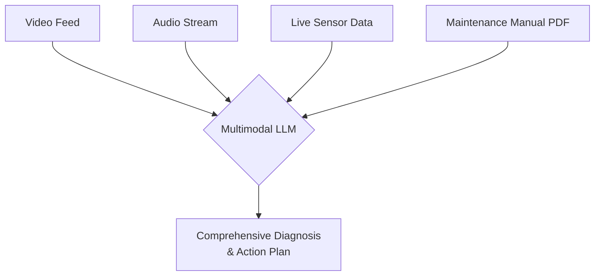
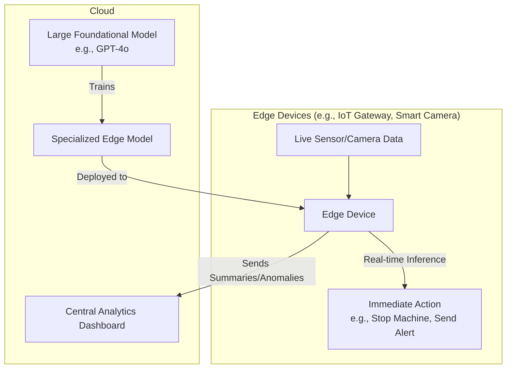
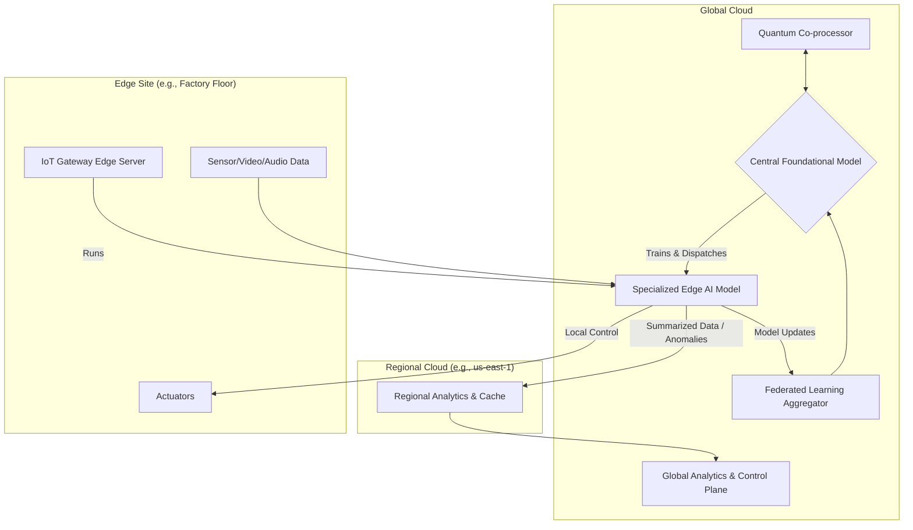

# Chapter 29: Emerging Patterns and Future Trends

The world of AI is moving at a breathtaking pace. The models, techniques, and architectures we use today were science fiction just a few years ago. As a developer in this space, it's not enough to master the present; you must also have a clear view of the future. The patterns that are emerging in research labs and cutting-edge startups today will be the standard tools of tomorrow.

This chapter is your look over the horizon. We will explore the most significant emerging trends that are shaping the future of AI application development. We'll move beyond the established patterns and look at the next wave of innovation, from truly multimodal AI that understands the world through multiple senses at once, to the challenges and opportunities of deploying powerful AI models directly onto edge devices. Understanding these trends will not only prepare you for the future but also give you an edge in building more innovative and capable systems today.

### Learning Objectives

By the end of this chapter, you will be able to:

-   Understand the concept and implications of **truly multimodal AI**.
-   Explore the architecture and use cases for **Edge AI**.
-   Grasp the principles of **Federated Learning** for privacy-preserving AI.
-   Look ahead to the potential impact of **Quantum Computing** on AI.
-   Design a next-generation IoT architecture that incorporates these future trends.

## Trend 1: Beyond Text and Images - True Multimodality

Until recently, "multimodal" AI meant being able to process text *or* an image. The next generation of models, exemplified by Google's Gemini, can process multiple, different types of media *within a single prompt*. They can reason across text, images, audio, and video simultaneously, creating a much richer and more context-aware understanding of a problem.

Imagine an AI that can:
-   **Watch** a video of a machine operating on a factory floor.
-   **Listen** to the audio of the machine to detect unusual sounds.
-   **Read** the machine's live sensor data stream.
-   **Analyze** the maintenance manual (a PDF with diagrams).

...all at the same time to diagnose a potential failure. This is the power of true multimodality.

### Architectural Implications

This shift requires a new architectural pattern where the AI model becomes a central "sensory fusion" hub.



### A Practical Example: Multimodal Industrial Diagnosis

Let's build a conceptual system that uses a multimodal model to perform a comprehensive diagnosis.

```python
# multimodal_diagnosis.py
import google.generativeai as genai
import PIL.Image

# Assume genai is configured with an API key
# genai.configure(api_key="YOUR_GOOGLE_API_KEY")

class MultimodalDiagnostician:
    def __init__(self):
        # Use a model designed for multimodal input
        self.model = genai.GenerativeModel('gemini-1.5-pro')

    def diagnose_machine_failure(self, video_path: str, audio_path: str, sensor_logs: str, manual_path: str):
        """
        Performs a diagnosis using video, audio, text logs, and a PDF manual.
        """
        print("--- Starting Multimodal Diagnosis ---")
        
        # 1. Upload the media files to the AI provider
        print("Uploading media files...")
        video_file = genai.upload_file(path=video_path)
        audio_file = genai.upload_file(path=audio_path)
        manual_pdf = genai.upload_file(path=manual_path)
        
        # In a real system, you would wait for processing to complete
        print("Files uploaded (simulated processing).")

        # 2. Construct the single, multimodal prompt
        prompt = f"""
You are an expert industrial maintenance engineer. Analyze the following data sources to diagnose a potential failure in Machine-007.

**1. Live Sensor Logs:**
```
{sensor_logs}
```

**2. Maintenance Manual:**
I have provided the full PDF manual for the machine. Please refer to it for specifications and troubleshooting procedures.

**3. Video and Audio Feed:**
I have provided a video and audio recording of the machine during the fault period.

**Your Task:**
Synthesize information from ALL sources to answer the following:
- What is the most likely root cause of the failure?
- Cite specific evidence from the video (timestamps), audio (unusual sounds), logs, and the manual to support your diagnosis.
- Provide a prioritized, step-by-step action plan for the maintenance team.
"""

        # 3. Make the API call with all content types
        print("Sending multimodal prompt to Gemini...")
        response = self.model.generate_content([
            prompt,
            manual_pdf,
            video_file,
            audio_file
        ])

        return response.text

# --- Example Usage (Conceptual) ---
# To run this, you would need actual video, audio, and PDF files.
# diagnostician = MultimodalDiagnostician()
#
# live_logs = "14:30:15 - Motor current: 5.2A | 14:30:16 - Vibration: 3.5g | 14:30:17 - Temp: 95C"
#
# final_report = diagnostician.diagnose_machine_failure(
#     video_path="machine_fault.mp4",
#     audio_path="machine_noise.mp3",
#     sensor_logs=live_logs,
#     manual_path="machine_manual.pdf"
# )
#
# print("\n--- Comprehensive Multimodal Diagnosis Report ---")
# print(final_report)
```

This pattern represents a future where AI applications are not just text-in, text-out, but can perceive and reason about the world through multiple senses, leading to far more accurate and context-aware insights.

## Trend 2: The Rise of Edge AI

Currently, most AI processing happens in the cloud. We send a request to a massive data center, and a response comes back. This works well, but it has three major drawbacks:

1.  **Latency:** The round-trip time to the cloud can be too slow for truly real-time applications (e.g., self-driving cars, high-speed manufacturing quality control).
2.  **Cost:** Sending a constant stream of high-bandwidth data (like video) to the cloud is expensive.
3.  **Privacy/Security:** For sensitive data (e.g., medical or proprietary information), sending it to a third-party server is often not an option.

**Edge AI** solves these problems by running smaller, specialized AI models directly on the device itself (the "edge").

### The Edge AI Architecture

In this model, the cloud is used for training large models and performing deep, non-real-time analysis, while the edge devices handle immediate, low-latency tasks.



### A Conceptual Edge AI Implementation

Running a full LLM on a small device is still challenging, but smaller, highly optimized models are becoming increasingly capable. Let's design a system using a conceptual "EdgeAI" library.

```python
# edge_ai_concept.py

# This is a conceptual library representing a future Edge AI SDK
class EdgeAIModel:
    def __init__(self, model_path: str):
        # In a real system, this would load a compiled, optimized model
        # onto the edge device's hardware (e.g., a TPU or NPU).
        print(f"Loading optimized edge model from {model_path}...")
        self.model = "Simulated Edge Model"
    
    def analyze(self, image_frame) -> dict:
        """Performs fast, local inference on an image frame."""
        # This analysis happens directly on the device, with no cloud call.
        # It's trained for a very specific task.
        print("Performing local inference on edge device...")
        # Simulate analysis
        if "crack" in image_frame:
            return {"defect_detected": True, "type": "crack", "confidence": 0.98}
        return {"defect_detected": False}

class EdgeDevice:
    def __init__(self, device_id: str, cloud_endpoint: str):
        self.device_id = device_id
        self.cloud_endpoint = cloud_endpoint
        # Load the specialized model onto the device
        self.defect_detector = EdgeAIModel(model_path="/models/defect_detector_v2.edge")

    def process_camera_feed(self):
        """Simulates processing a live camera feed from a manufacturing line."""
        while True:
            # frame = get_next_camera_frame() # Get a new image
            frame = "Frame with a tiny crack" if random.random() > 0.95 else "Normal frame"
            
            # Perform real-time analysis locally
            analysis = self.defect_detector.analyze(frame)
            
            if analysis["defect_detected"]:
                # Take immediate, low-latency action
                self.trigger_local_alarm()
                # Send a small, high-priority message to the cloud for logging and central analysis
                self.send_to_cloud({"event": "defect_alert", "analysis": analysis})
            
            # Periodically, send a summary to the cloud (not every frame)
            if time.time() % 60 < 1: # Once per minute
                summary = {"event": "heartbeat", "status": "operational", "frames_processed": 600}
                self.send_to_cloud(summary)
                
            time.sleep(0.1) # Process 10 frames per second

    def trigger_local_alarm(self):
        print(f"[{self.device_id}] DEFECT DETECTED! Stopping conveyor belt immediately.")

    def send_to_cloud(self, data: dict):
        print(f"[{self.device_id}] Sending data to cloud: {data['event']}")
        # In a real system, this would be an MQTT message or HTTPS request
```

Edge AI represents a shift towards a more distributed, resilient, and responsive form of intelligence.

## Trend 3: Federated Learning and Privacy

One of the biggest hurdles for AI adoption is data privacy. Many organizations cannot or will not send their sensitive data to a third-party cloud service for training. **Federated Learning** offers a revolutionary solution to this problem.

**The Concept:** Instead of bringing the data to the model (in the cloud), you bring the model to the data.

**Workflow:**
1.  A central server sends a copy of the current AI model to many individual devices (e.g., phones, hospital servers).
2.  Each device trains its local copy of the model on its own private data, which *never leaves the device*.
3.  The devices don't send the data back. Instead, they send only the small, anonymized *updates* to the model's weights (the mathematical changes they learned) back to the central server.
4.  The central server aggregates these updates from all devices to create an improved, globally shared model, without ever having seen the private data.

This pattern allows for collaborative model training without centralizing sensitive data, which will be critical for industries like healthcare, finance, and defense.

## Trend 4: The Quantum Leap - AI and Quantum Computing

This is the most forward-looking trend, but its potential is staggering. While classical computers use bits (0s or 1s), quantum computers use **qubits**, which can exist in a superposition of both 0 and 1 simultaneously. This allows them to perform certain types of calculations exponentially faster than any classical computer.

**Potential Impact on AI:**
-   **Exponentially Faster Training:** Training today's massive LLMs takes months and costs millions of dollars. Quantum machine learning algorithms could potentially reduce this to hours or days.
-   **Solving "Unsolvable" Problems:** Quantum computers excel at optimization problems, which are at the heart of many AI challenges, from logistics and drug discovery to materials science. An AI could use a quantum computer as a specialized "tool" to solve a problem that is computationally impossible for classical systems.
-   **Breaking Current Cryptography:** This is also a major security concern. Quantum computers will be able to break most of the encryption that protects our data today, necessitating the development of new, "quantum-resistant" cryptography, a task where AI itself can assist.

While we are still in the very early days of quantum AI, it is a field to watch closely. The convergence of these two powerful technologies will likely define the next era of computing.

## Designing a Next-Generation IoT Architecture

Let's synthesize these future trends into a forward-looking architecture for a global IoT platform.



**Key Features of this Future Architecture:**
1.  **Edge-First Processing:** Most real-time decisions (e.g., safety shutdowns, quality control) are made locally on the `Edge AI Model` (**Trend 2**). This ensures low latency and reduces data transmission costs.
2.  **Federated Learning:** The `Edge AI Model` is continuously improved by aggregating anonymized learnings from all edge sites via the `Federated Learning Aggregator` (**Trend 3**), without ever exposing sensitive factory floor data.
3.  **Multimodal Awareness:** The `Edge AI Model` processes video, audio, and sensor data together to make more accurate local decisions (**Trend 1**).
4.  **Quantum-Assisted Optimization:** The `Central Foundational Model` in the cloud can offload extremely complex optimization problems (e.g., re-routing the entire global supply chain in response to a disruption) to a `Quantum Co-processor` (**Trend 4**).
5.  **Efficient Data Flow:** Only summaries, anomalies, and model updates are sent between the edge and the cloud, dramatically reducing bandwidth requirements compared to streaming all raw data.

## Conclusion

The field of AI is not static; it is a landscape of constant evolution. As a developer, your role is not just to build with the tools of today, but to architect systems that are ready for the tools of tomorrow.

You have now explored the frontiers of AI development:
-   **True Multimodality** is breaking down the barriers between data types, allowing for a more holistic understanding.
-   **Edge AI** is pushing intelligence closer to the data source, enabling a new class of low-latency, private, and resilient applications.
-   **Federated Learning** offers a path to collaborative AI that respects data privacy.
-   **Quantum Computing** looms on the horizon as a technology that could fundamentally change the scale and scope of problems AI can solve.

By understanding these emerging patterns, you are no longer just following the AI revolution—you are positioned to be at its forefront, ready to build the next generation of intelligent systems.

# References and Further Reading

- [The Top 13 Trends in 2024: AI Predictions (HackerNoon)](https://hackernoon.com/the-top-13-trends-in-2024-ai-predictions)
- [9 REAL AI trends to watch in 2025 (Pragmatic Coders, Medium)](https://medium.com/@pragmaticcoders/9-real-ai-trends-to-watch-in-2025-bee4e9ab427c)
- [9 REAL AI trends to watch in 2025 (Pragmatic Coders, Blog)](https://www.pragmaticcoders.com/blog/ai-predictions-top-ai-trends)
- [AI Progress in 2025: What’s Happened and What’s Next (Digital Bricks)](https://www.digitalbricks.ai/blog-posts/ai-progress-in-2025-whats-happened-and-whats-next)
- [The State of Artificial Intelligence in 2025: Breakthroughs, Challenges, and the Road Ahead (TS2.Tech)](https://ts2.tech/en/the-state-of-artificial-intelligence-in-2025-breakthroughs-challenges-and-the-road-ahead-updated-2025-july-1st-1202-cet/)