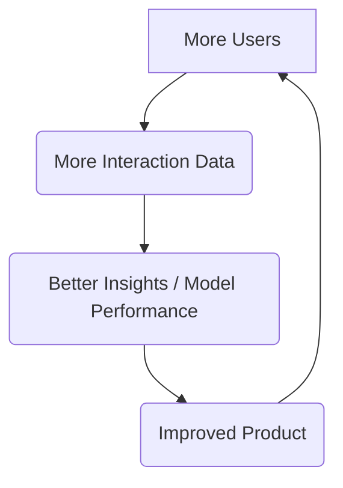

# Chapter 30: Building Your AI Product

You have reached the final chapter of this guide. You have journeyed from the fundamental concepts of tokens and embeddings to the intricate architectures of scalable, real-time AI systems. You have mastered the APIs of the world's leading AI providers, engineered sophisticated prompts, and learned to build and test applications with the discipline of a production engineer. You are no longer just a developer who *uses* AI; you are an AI systems architect.

But a perfectly engineered engine is useless without a car to put it in. A brilliant AI model is just a curiosity without a product that delivers its value to a user. This final chapter is about that last, crucial step: moving from building AI *systems* to building AI *products*. It's about bridging the gap between technical capability and real-world value. We will explore how to identify problems worth solving with AI, how to design a product around an AI core, and how to think like an entrepreneur to turn your technical skills into a successful application.

### Learning Objectives

By the end of this chapter, you will be able to:

-   Shift your mindset from "what can AI do?" to "what user problem can AI solve?"
-   Use the **Lean AI Canvas** to rapidly ideate and validate AI product ideas.
-   Understand the concept of a **Minimum Viable Product (MVP)** in the context of AI.
-   Design a **data flywheel** to create a defensible, continuously improving AI product.
-   Navigate the key stages of launching and scaling an AI-native product.
-   Embrace your new role as an architect of intelligent solutions.

## The Most Important Shift: From Technology to Solution

The first and most critical step in building an AI product is a mental one. As engineers, we are often fascinated by the technology itself. We ask, "What cool thing can I build with this new video analysis API?" This is the wrong question. It's a path that leads to impressive tech demos but rarely to successful products.

The right question is: **"What difficult, expensive, or previously impossible user problem can I now solve with this technology?"**

Your thinking must evolve from being technology-first to being problem-first.
-   **Don't** build a generic "document summarizer."
-   **Do** build a "legal contract risk analyzer for solo law practitioners" that uses summarization as one of its tools.
-   **Don't** build an "image generation app."
-   **Do** build a "virtual staging tool for real estate agents" that uses image generation to furnish empty rooms.

The AI is the engine, not the car. Your users don't want to buy an engine; they want to buy a car that gets them from Point A (their problem) to Point B (their desired outcome). Your job is to build the entire car—the user interface, the workflows, the support, the reliability—all powered by the AI engine at its core.

## The Blueprint: The Lean AI Canvas

Before writing a single line of production code, you need a plan. But traditional business plans are too slow for the fast-paced world of AI. Instead, we can adapt the "Lean Canvas" methodology specifically for AI products. This one-page blueprint forces you to answer the most critical questions about your idea.

Here is the **Lean AI Canvas**:

| **1. Problem**   *What top 1-3 problems are you solving?* | **2. Customer Segments**   *Who are your target customers? Who are the early adopters?* | **3. Unique Value Proposition**   *What is your single, clear, compelling message?* | **4. Solution**   *What are the top 3 features of your product?* |
| :--- | :--- | :--- | :--- |
| **5. AI Core**   *What is the specific AI skill? (e.g., classification, generation, agentic workflow)* | **6. Data Moat**   *How does your product get better as more people use it? What unique data do you capture?* | **7. Key Metrics**   *What key activities do you measure to gauge success? (e.g., tasks completed, time saved)* | **8. Channels**   *What are your paths to customers? (e.g., API, web app, integration)* |
| **9. Cost Structure**   *What are your fixed and variable costs? (API calls, GPU hosting, storage, team)* | **10. Revenue Streams**   *How will you make money? (e.g., per-call, subscription, per-seat)* | **11. Unfair Advantage**   *What makes you hard to copy? (e.g., proprietary data, unique workflow, domain expertise)* |

### Case Study: Filling out the Canvas for an IoT Product

Let's apply this to an idea that builds on the concepts from this book: an AI-powered predictive maintenance platform for industrial machinery, which we'll call **"PredictoMaint"**.

| **1. Problem** | **2. Customer Segments** | **3. Unique Value Proposition** | **4. Solution** |
| :--- | :--- | :--- | :--- |
| 1. Unexpected equipment failures cause costly downtime.   2. Manual inspection is time-consuming and inefficient.   3. It's hard to know when to perform maintenance (too early is wasteful, too late is catastrophic). | *Target Customers:* Manufacturing plant managers, maintenance chiefs.   *Early Adopters:* Tech-forward factories with existing IoT sensor deployments. | **Predict machine failures before they happen.**   *Stop guessing, start predicting. Turn your sensor data into actionable maintenance schedules.* | 1. Real-time anomaly detection from sensor streams.   2. AI-generated root cause analysis reports.   3. Automated, prioritized maintenance ticket generation. |
| **5. AI Core** | **6. Data Moat** | **7. Key Metrics** | **8. Channels** |
| An AI agent that analyzes time-series sensor data (vibration, temp, pressure) to classify equipment health and predict time-to-failure. | With every failure event it sees across all customers, the core prediction model gets more accurate at identifying early warning signs. It learns unique failure signatures for specific machine types. | - Reduction in unplanned downtime (%).   - Increase in maintenance team efficiency (hours saved).   - Accuracy of failure predictions. | - Web-based dashboard for managers.   - Mobile app for field technicians.   - API for integration with existing maintenance systems (e.g., SAP, Maximo). |
| **9. Cost Structure** | **10. Revenue Streams** | **11. Unfair Advantage** |
| *Variable Costs:* AI API calls per analysis, cloud hosting for data, SMS/email for alerts.   *Fixed Costs:* Engineering team salaries, platform maintenance. | Subscription model based on the number of monitored machines (e.g., $50/machine/month). Enterprise tier with API access and dedicated support. | Our growing, proprietary dataset of machine failure signatures across multiple industries, which makes our predictive models increasingly accurate and hard for a new competitor to replicate. |

Spending an hour filling out this canvas can save you months of building the wrong thing. It forces clarity and exposes the weakest parts of your idea before you invest significant resources.

## The Build: From MVP to a Learning Machine

With a validated idea, it's time to build. But don't build the whole thing. Your goal is to build a **Minimum Viable Product (MVP)**—the smallest possible version of your product that can solve the core problem for your early adopters.

### The "Wizard of Oz" MVP: A Secret Weapon for AI Products

For AI products, the best MVP is often one that doesn't use any AI at all. In a "Wizard of Oz" MVP, you build the user interface, but the "AI" is actually a human expert behind the scenes.

For our **PredictoMaint** example:
1.  Build a simple dashboard where a customer can upload their sensor data (e.g., as a CSV file).
2.  When a file is uploaded, it sends you an email.
3.  *You* (or a domain expert) manually analyze the data, write a report, and email it back to the customer.

**Why is this so powerful?**
-   **It tests the value proposition.** Will customers even bother to upload their data? Are they willing to pay for the report? You are testing the *demand* for the solution before building the complex technology.
-   **It generates your first training dataset.** The inputs from your first users and the expert analyses you write become the high-quality, perfectly formatted examples you'll need later for fine-tuning.
-   **It's incredibly fast and cheap to build.**

You keep the human "wizard" behind the curtain until you've proven that the product is valuable and you have enough data to start automating the process with a real AI model.

### Building Your Data Flywheel

The most defensible AI products are those that get better the more they are used. This is known as the **data flywheel**. It's a virtuous cycle that creates a powerful competitive advantage.

For **PredictoMaint**, the flywheel works like this:
1.  A new customer signs up and provides sensor data from their unique machines.
2.  Our system analyzes the data. When a machine eventually fails, we capture that specific failure signature (the pattern of sensor readings that led up to the failure).
3.  This new, labeled data is used to retrain and improve our core predictive model.
4.  The improved model can now predict failures more accurately for *all* of our customers.
5.  This makes the product more valuable, which attracts more customers, which brings in more unique data, and the cycle repeats.

Your product architecture must be designed from day one to capture this interaction data (with user consent and privacy protections, of course). This is your "unfair advantage."

### The Ethical Review Checklist

Before you launch, you must conduct an ethical review. AI products carry unique responsibilities. Ask your team these questions:
-   **Safety:** What is the worst-case scenario if our AI gives a wrong answer? (For PredictoMaint, a missed prediction could lead to equipment damage). What safeguards are in place? (e.g., A Human-in-the-Loop approval for critical maintenance).
-   **Bias:** Is our training data representative? Could our AI be biased against certain types of machines, environments, or users?
-   **Privacy:** Are we handling user data responsibly? Is sensitive information anonymized before being sent to third-party APIs? Do users have control over their data?
-   **Transparency:** Are we clear with our users about what is AI-generated and what is not? Do we explain the limitations of our AI?

## The Launch and Beyond: The Whole Product

Launching your MVP is just the beginning. A successful product is more than just a clever AI model. You must build the "whole product" around it.

-   **User Experience (UX):** Is the interface intuitive? Does it build trust? How do you display AI-generated content so that users understand its probabilistic nature?
-   **Documentation & Support:** How do you explain your AI's features? What happens when a user gets a confusing or incorrect answer?
-   **The Iteration Loop:** AI products are never "done." You are in a constant loop of collecting user feedback, analyzing model performance, gathering new data, and redeploying improved versions. Your DevOps pipeline (Chapter 25) is critical to making this loop fast and reliable.

## Your Journey as an AI Architect

Congratulations. You have completed a journey that has taken you from the first principles of AI to the strategic complexities of building and launching AI-native products. You began by learning the language of this new technological era—the grammar of prompts, the vocabulary of models, the syntax of APIs. You then became an engineer, learning to build resilient, scalable, and secure systems that can deliver intelligence reliably.

Now, you have reached the final stage. You are no longer just a developer who uses AI. You are an **architect of intelligent solutions**. You understand that the technology, while fascinating, is merely a tool. Your true skill lies in identifying a human need and artfully combining data, prompts, models, and code into a product that solves a real-world problem.

The AI revolution is not about the models themselves; it is about what we build with them. It is a new set of building blocks, perhaps the most powerful ever created. The field is young, the patterns are still emerging, and the greatest applications have yet to be built.

You have the tools. You have the knowledge. You have the blueprint.

Go build the future.

# References and Further Reading

- [Your Guide to AI Product Strategy (Aakash Gupta, 2025)](https://www.news.aakashg.com/p/ai-product-strategy?utm_source=publication-search)
- [AI Progress in 2025: What’s Happened and What’s Next (Digital Bricks)](https://www.digitalbricks.ai/blog-posts/ai-progress-in-2025-whats-happened-and-whats-next)
- [The State of Artificial Intelligence in 2025: Breakthroughs, Challenges, and the Road Ahead (TS2.Tech)](https://ts2.tech/en/the-state-of-artificial-intelligence-in-2025-breakthroughs-challenges-and-the-road-ahead-updated-2025-july-1st-1202-cet/)
- [AI Product Management: How to Build AI Products (Product School)](https://productschool.com/blog/product-management-2/product-management-for-ai/)
- [How to Build an AI Product: A Step-by-Step Guide (VentureBeat)](https://venturebeat.com/ai/how-to-build-an-ai-product-a-step-by-step-guide/)